# TeaChess

### Professor digital de xadrez — protótipo acadêmico de uma experiência integrada de jogo, análise e estudo


> **Aviso:** o TeaChess é um protótipo acadêmico. A experiência pública do produto continua baseada em dados, análises, adversários, professores e respostas simulados. Rotas técnicas isoladas validam a integração server-side com LLM, mas não estão conectadas à interface do Professor IA nem representam uma plataforma de xadrez em produção.

**Endpoint público:** [Acessar o TeaChess](https://teachess.vercel.app/)

## 1. Visão geral

Quem estuda xadrez costuma distribuir sua rotina entre plataformas de jogo, anotações, imagens de posições, vídeos, exercícios e planilhas. Esse processo fragmentado dificulta reunir partidas, identificar erros recorrentes e transformar resultados isolados em um plano contínuo de evolução.

O TeaChess propõe centralizar essa jornada. O protótipo permite navegar por partidas, métricas, análises didáticas simuladas, posições enviadas por imagem, treinamento pessoal, ranking e uma demonstração local da experiência de jogo. Também apresenta como poderiam funcionar, no futuro, um professor baseado em IA e a contratação de professores humanos.

O produto distingue duas origens de partida:

- **Partidas da plataforma:** seriam registradas e validadas pelo próprio TeaChess. No modelo atual, alimentam estatísticas oficiais e ranking.
- **Partidas externas:** são cadastradas manualmente pelo jogador, permanecem privadas e podem compor apenas sua visão pessoal combinada. Não alteram rating nem ranking oficial.

A visão de futuro inclui explicações didáticas apoiadas por IA, análise técnica fornecida por um motor de xadrez, reconhecimento de posições por visão computacional e revisão por professores humanos. A segunda etapa já possui uma integração técnica isolada com LLM para experimentação, mas nenhum desses serviços está integrado à experiência real do produto. O sistema atual demonstra os fluxos públicos com componentes interativos, mocks e regras executadas localmente.

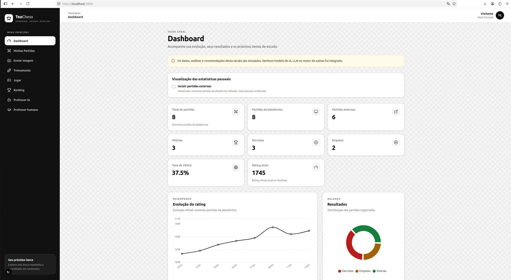

## 2. Problema e solução proposta

### Que problema o sistema resolve?

O TeaChess organiza em uma única interface os principais elementos da evolução de um enxadrista: histórico de partidas, contexto de cada jogo, erros recorrentes, rating, posições de estudo, exercícios e próximos passos. A proposta reduz a distância entre “jogar uma partida” e “entender o que estudar depois”.

### Para quem foi criado?

O protótipo foi pensado principalmente para jogadores iniciantes e intermediários que jogam tanto em plataformas digitais quanto presencialmente e precisam de uma visão organizada do próprio aprendizado. Os fluxos também contemplam jogadores que desejam orientação futura de IA ou acompanhamento de um professor humano.

### Por que o problema é desafiador?

Partidas podem ter origens, níveis de confiabilidade, permissões e campos diferentes. Uma partida oficial afeta dados públicos; uma partida externa não pode fazer isso. Rating histórico não é igual a rating atual. Imagens, conversas, notas e treinamento exigem privacidade. Além disso, análise técnica, explicação pedagógica, reconhecimento visual e cálculo competitivo são responsabilidades diferentes e não devem ser confundidas.

### Como a IA generativa poderá ajudar futuramente?

Uma integração futura poderá transformar fatos técnicos já validados em explicações adequadas ao nível do aluno, relacionar padrões autorizados do histórico, responder perguntas e organizar planos de estudo. O modelo de linguagem não deverá inventar avaliações ou melhores lances: esses dados deverão vir de um motor de xadrez, enquanto posições reconhecidas em imagens deverão ser confirmadas pelo usuário antes de qualquer análise.

### Relação com a complexidade da atividade

A complexidade não está apenas na quantidade de telas. Ela aparece na coordenação entre rotas dinâmicas, formulários tipados, filtros, tabelas, gráficos, tabuleiros, diálogos, estados vazios e de erro, persistência, migrações, responsividade, acessibilidade e regras de autorização simuladas. O protótipo precisa manter coerência entre todos esses fluxos sem apresentar dados simulados como resultados reais.

## 3. Funcionalidades implementadas

### Dashboard

**O que funciona:** calcula localmente total de partidas, vitórias, derrotas, empates e taxa de vitória; apresenta histórico recente, gráfico de rating, distribuição de resultados, aberturas frequentes, erros e recomendação de estudo. O usuário pode alternar entre a visão oficial e a visão privada combinada com partidas externas.

**O que é mockado:** partidas iniciais, análises, erros e recomendações. Os gráficos derivam desses dados locais.

**Futuro:** métricas provenientes de partidas validadas em backend e análises técnicas reais. Partidas externas continuarão fora do rating e do ranking oficial.

### Minhas Partidas

**O que funciona:** listagem responsiva em tabela e cartões, busca, filtros, ordenação, resumo, estados vazio e sem resultados, navegação para detalhes, edição e análise, além de restauração dos dados de demonstração.

**O que é mockado:** o conjunto inicial de partidas e usuários.

**Futuro:** sincronização segura com banco de dados, autenticação e autorização no servidor.

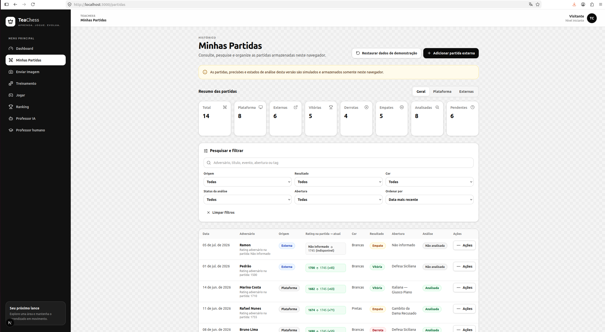

### Cadastro de partidas externas

**O que funciona:** formulário para criar uma partida externa privada com origem, jogadores, resultado, data, cor, PGN, FEN, ratings opcionais, abertura, quantidade de lances, tags e observações. Os campos são validados no cliente e o registro é salvo no navegador.

**O que é mockado:** não há importação ou verificação junto ao Chess.com, Lichess ou qualquer outra fonte.

**Futuro:** importação autorizada, validação de notação e persistência em backend.

### Edição de partidas

**O que funciona:** partidas externas próprias permitem edição dos dados e exclusão; partidas da plataforma próprias permitem alterar somente observações e tags. As permissões são centralizadas em helpers e repetidas na store.

**O que é mockado:** propriedade e papel do usuário são definidos por dados locais. Esconder ou bloquear controles no frontend não oferece segurança real.

**Futuro:** autenticação, autorização e auditoria no servidor; edição técnica de partidas oficiais apenas por administração autorizada.

### Detalhes

**O que funciona:** exibição de origem, privacidade, resultado, jogadores, ratings histórico e atual, abertura, lances, PGN, FEN, tags, observações e ações permitidas. Há tratamento para campos opcionais, ID inexistente e acesso indisponível.

**O que é mockado:** perfis e ratings atuais vêm do catálogo local.

**Futuro:** dados oficiais e controle de acesso garantido pelo backend.

### Análise simulada

**O que funciona:** tabuleiro navegável, lista e navegação de lances, gráfico de avaliação, resumo, momentos críticos, categorias de erro, pontos fortes, pontos a melhorar e comentários didáticos. O PGN é interpretado localmente quando possível.

**O que é mockado:** avaliações, precisão, melhores lances, variantes, erros e comentários. Não existe Stockfish, outro motor ou IA por trás da página.

**Futuro:** análise técnica por motor apropriado, persistência dos resultados e explicação pedagógica rastreável.

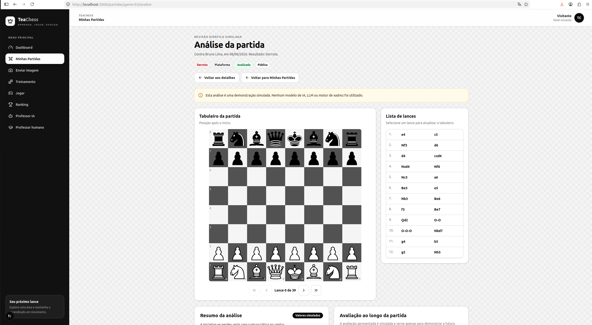

### Envio de imagem

**O que funciona:** envio de uma única imagem PNG, JPEG ou WebP de até 10 MB por seleção ou arrastar e soltar; validação, preview temporário, formulário de contexto, listagem, detalhes e exclusão dos próprios registros.

**O que é mockado:** FEN, lado a jogar e confiança eventualmente exibidos são determinísticos e rotulados como simulados. O arquivo real não é enviado nem persistido; somente seus metadados e o formulário ficam no `localStorage`.

**Futuro:** armazenamento privado, visão computacional, confirmação da posição reconhecida e controles reais de acesso. Não há OCR nem reconhecimento de peças nesta versão.

### Estudo de posição

**O que funciona:** página privada por ID, tabuleiro interativo com movimentos legais via `chess.js`, inversão de orientação, restauração da posição, cópia do FEN demonstrativo, favorito e notas pessoais.

**O que é mockado:** a posição reconhecida. Após F5, o preview da imagem real deixa de existir porque object URLs são temporárias. A posição inicial pode aparecer apenas como placeholder quando não há FEN.

**Futuro:** reconhecimento visual confirmado pelo usuário, análise por motor e compartilhamento explícito e autorizado.

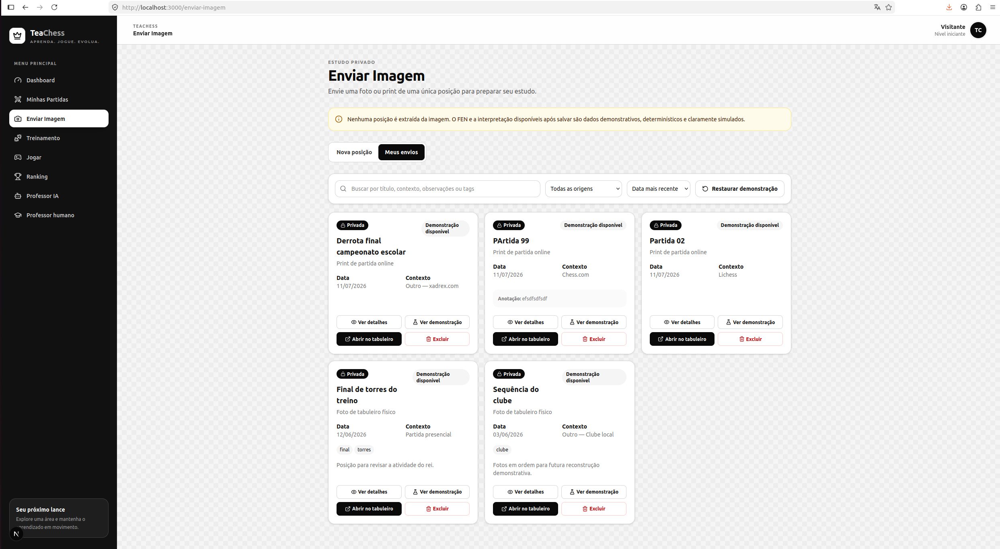

### Treinamento

**O que funciona:** plano semanal, indicadores, pontos fortes e fracos, temas recomendados, biblioteca com busca e filtros, progresso de exercícios, histórico de conclusões e restauração do estado inicial. O usuário escolhe escopo oficial ou privado combinado.

**O que é mockado:** temas, exercícios e explicações são derivações determinísticas de catálogos, partidas e análises locais. Quando faltam análises, a interface declara o uso de fallback mockado. Não há geração ou correção inteligente.

**Futuro:** exercícios reais, adaptação progressiva e explicações baseadas em dados técnicos validados e consentidos.

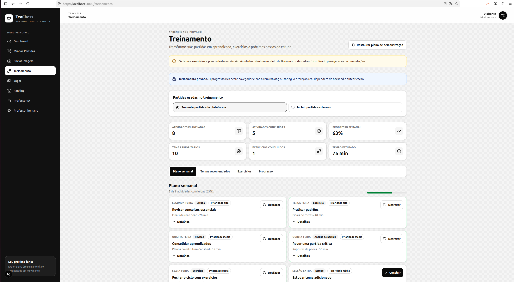

### Ranking

**O que funciona:** pódio, tabela, filtros, ordenação determinística, resumo, sequência, regras e perfis públicos demonstrativos. Somente partidas da plataforma entram nos números oficiais.

**O que é mockado:** jogadores, rating, histórico de posições e estatísticas competitivas. Não há cálculo Elo real.

**Futuro:** rating calculado no servidor a partir de partidas oficiais validadas, medidas antifraude e perfis autenticados.

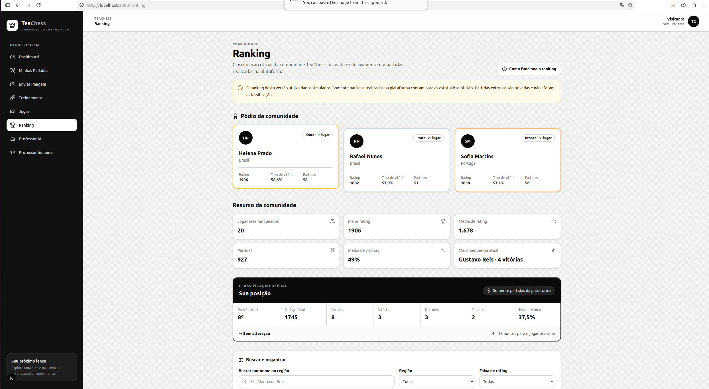

### Jogar

**O que funciona:** configuração de controle de tempo e cor, busca local, filtros de adversários, desafios, salas abertas simuladas, tabuleiro com movimentos legais, relógios, orientação, histórico, chat local, empate, abandono e diálogos de resultado. Uma única sessão demonstrativa pode ficar ativa e seu estado é sincronizado entre abas do mesmo navegador.

**O que é mockado:** adversários, presença, matchmaking e salas. O mesmo usuário controla os dois lados; não há bot, escolha automática de lances, WebSocket ou outro jogador conectado. A sessão não cria uma partida no histórico e não altera rating, ranking, análise ou treinamento.

**Futuro:** autenticação, conexão em tempo real, relógios e validação de movimentos no servidor, persistência e rating oficial.

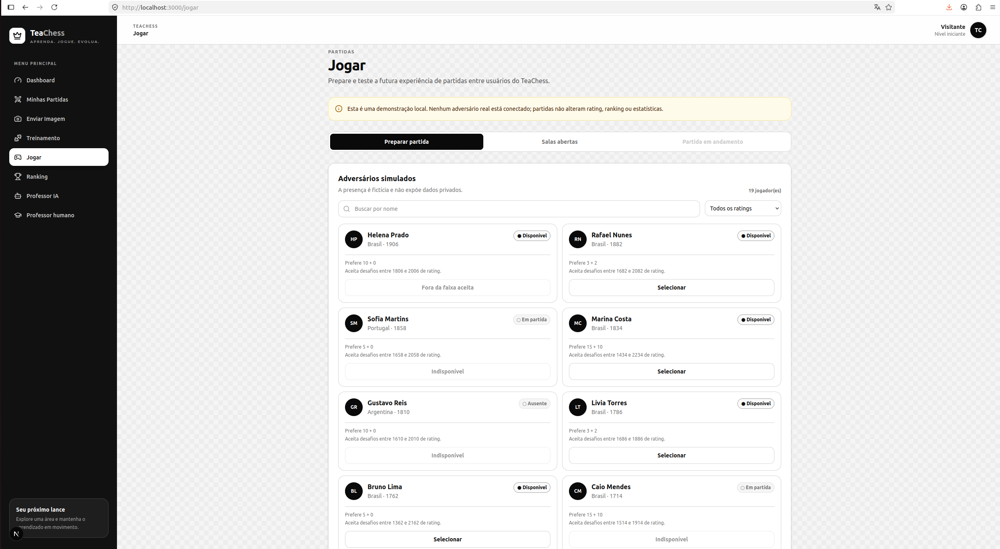

### Professor IA

**O que funciona:** na rota histórica `/futura-ia`, o usuário pode explorar capacidades, arquitetura, roadmap e uma conversa demonstrativa contextualizada por uma partida ou posição privada. Perguntas livres ou sugeridas selecionam templates locais; as 30 interações mais recentes são persistidas.

**O que é mockado:** todas as respostas dessa interface. A seleção usa correspondência simples de termos e templates determinísticos, não compreensão semântica. A rota `/futura-ia` não chama LLM, OpenAI API, motor, OCR, visão computacional ou outro serviço de rede.

**Futuro:** conectar de forma segura a integração técnica já iniciada à interface, separando reconhecimento visual, avaliação do motor e explicação do modelo; aplicar consentimento, rastreabilidade, indicação de fontes, incerteza e revisão humana. A OpenAI foi escolhida como primeiro provedor e o `gpt-5-mini` como modelo inicial sujeito a avaliação.

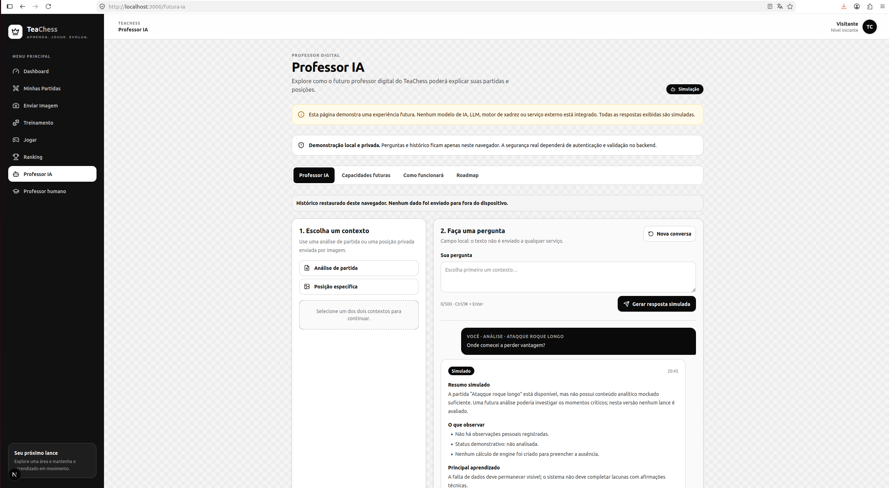

### Professor humano

**O que funciona:** catálogo de dez personas fictícias, busca e filtros locais, perfil, biografia, metodologia, avaliações, seleção de horário online, resumo, confirmação, consulta, cancelamento e repetição de um agendamento local.

**O que é mockado:** pessoas, títulos, avaliações, disponibilidade, preços e agendamentos. Confirmar não reserva horário, não cobra, não envia mensagem e não cria aula ou videochamada.

**Futuro:** profissionais reais, autenticação, agenda, comunicação, autorização para compartilhar dados, notificações, pagamento e infraestrutura de aula online.

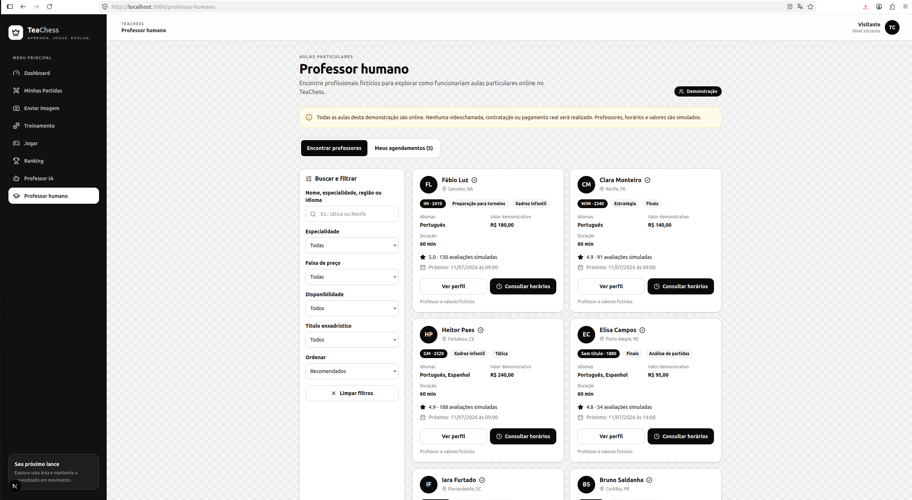

## 4. Regras de negócio principais

### Partidas da plataforma

- Contam para ranking, rating e estatísticas oficiais.
- São públicas no modelo demonstrativo.
- Não podem ser excluídas ou tecnicamente editadas pelo jogador.
- O proprietário pode alterar observações e tags.
- Dados como rating no momento da partida, abertura e quantidade de lances são registrados pelo sistema no modelo proposto.

### Partidas externas

- São privadas e pertencem ao usuário que as cadastrou.
- Não contam para ranking ou estatísticas públicas.
- Não alteram o rating oficial.
- Podem ser editadas e excluídas pelo proprietário.
- Podem participar de estatísticas privadas combinadas quando o usuário habilita essa preferência.
- Podem ter ratings, abertura e quantidade de lances ausentes; a interface não cria valores para preencher lacunas.

### Rating

- `playerRatingAtGame` e `opponentRatingAtGame` representam valores históricos no momento da partida.
- O rating atual vem do perfil oficial mockado e é apresentado separadamente.
- A comparação entre rating histórico e atual é apenas informativa.
- Uma partida externa nunca provoca alta ou queda do rating oficial.
- Quando o adversário externo não possui perfil TeaChess, seu rating atual fica indisponível.

### Privacidade

- Uploads, posições, conversas com o Professor IA, treinamento, agendamentos, observações e partidas externas são tratados como privados no fluxo do protótipo.
- Imagens não são persistidas, apenas metadados.
- Nenhum dado privado é compartilhado com professores humanos nesta versão.
- O histórico do Professor IA e os demais estados ficam somente no navegador.
- Essas regras são representadas no cliente e **não constituem proteção real**. Produção exigirá autenticação, autorização, backend seguro, auditoria e políticas de exclusão.

As regras completas estão em [`docs/business-rules.md`](docs/business-rules.md).

## 5. Arquitetura e tecnologias

O TeaChess usa uma arquitetura frontend com Next.js App Router. Páginas e layouts ficam no diretório `app/`; componentes clientes concentram a interatividade; stores Zustand coordenam estado compartilhado; dados e regras de domínio ficam fora da apresentação.

| Tecnologia | Uso no projeto |
| --- | --- |
| **Next.js 16.2.10** | App Router, rotas estáticas e dinâmicas, layouts, metadados e build de produção. |
| **React 19.2.4** | Componentes, estado local, efeitos, formulários, diálogos e interação. |
| **TypeScript 5** | Tipagem de entidades, props, stores, formulários e regras de negócio. |
| **Tailwind CSS 4** | Identidade visual, responsividade, estados de foco e composição dos layouts. |
| **Zustand 5.0.14** | Estado compartilhado, persistência, reidratação e migrações locais. |
| **Recharts 3.9.2** | Gráficos do Dashboard e da análise demonstrativa. |
| **chess.js 1.4** | Validação e reprodução local de movimentos legais. Não é motor de análise. |
| **react-chessboard 5** | Renderização e interação dos tabuleiros. |
| **react-dropzone 15** | Seleção, arrastar e soltar e validação inicial das imagens. |
| **Lucide React** | Ícones consistentes e leves. |
| **Vercel** | Hospedagem e disponibilização do endpoint público. |

### Por que Next.js + Vercel?

A arquitetura inicialmente sugerida pela atividade acadêmica, FastAPI + React, seria apropriada para um sistema já dependente de backend. Na primeira etapa, porém, o escopo autorizado era um protótipo completo de frontend, sem API, autenticação, banco ou serviços externos. Next.js permitiu manter React e organizar as telas em rotas claras dentro do mesmo projeto, com TypeScript de ponta a ponta e um processo simples de build. A segunda etapa acrescentou apenas rotas técnicas server-side isoladas para engenharia de LLM, sem transformar o protótipo em um backend de produto.

A escolha também simplificou o deploy na Vercel, favorece a responsividade e a acessibilidade e mantém aberta a possibilidade de adicionar APIs ou integrar um backend real posteriormente. Ela não elimina a necessidade futura de serviços seguros: cálculo competitivo, arquivos, autenticação, autorização, pagamentos, multiplayer e IA não devem depender apenas do cliente.

### Engenharia de LLM — estado da segunda etapa

#### Provedor e modelo

A OpenAI foi escolhida como provedora da primeira integração, e o `gpt-5-mini` como modelo inicial. A escolha é orientada a custo e à hipótese de suficiência para um fluxo bem delimitado; o modelo continua sujeito à avaliação no fluxo real e não é tratado como definitivo.

#### Integração implementada

A integração técnica usa o SDK oficial da OpenAI, exclusivamente no servidor, pela Responses API. `OPENAI_API_KEY` permanece em variável de ambiente não pública. As rotas técnicas são protegidas por uma flag server-side, ficam desabilitadas por padrão e incluem uma chamada textual mínima e uma rota com Structured Outputs. Nenhuma delas está conectada à interface do Professor IA.

#### Structured Outputs

O contrato provisório usa Zod e a combinação `responses.parse(...)`, `zodTextFormat(...)` e `response.output_parsed`. O schema é versionado como `provisional-teacher-response-v1`. A aderência estrutural permite validação e consumo previsível pela aplicação, mas não garante veracidade factual.

#### Prompting e evals

O system prompt `professor-ia-v1` permanece preservado como baseline histórico, e a comparação controlada de `EV-001` a `EV-006` foi concluída. O `professor-ia-v2` apresentou melhorias observadas naquele conjunto e foi preservado como o baseline do experimento conjunto `E-023`. Separadamente, `E-024` avaliou `professor-ia-v3` nos mesmos 12 casos curados: os acertos passaram de 8 para 11, a `decisionAccuracy` de 66,67% para 91,67%, as escolhas de Tool errada de 3 para 1 e os falsos positivos de 1 para 0, sem falsos negativos ou erros técnicos em ambas as versões. A v3 permanece apenas uma hipótese candidata: uma repetição não comprova estabilidade, generalização ou qualidade pedagógica, e o ganho observado veio acompanhado de mais tokens e latência. Os detalhes permanecem em [`docs/llm-experiments.md`](docs/llm-experiments.md) e [`docs/llm-prompting-evals.md`](docs/llm-prompting-evals.md).

#### Fase de Tools

A função interna determinística `get_position_context` possui uma definição estrita de Tool para a Responses API e um fluxo técnico controlado de function calling em rota isolada. O primeiro ciclo real foi validado localmente: a Tool foi executada no servidor sobre um snapshot autorizado, e uma comparação entre o mesmo contexto `confirmed` e `unconfirmed` preservou a diferença de suficiência esperada. A integração pública com a interface do Professor IA ainda não foi implementada. Os detalhes estão em [`docs/llm-tools.md`](docs/llm-tools.md), [`docs/llm-experiments.md`](docs/llm-experiments.md) e [`docs/llm-prompting-evals.md`](docs/llm-prompting-evals.md).

A segunda função determinística, `get_game_context`, agora também possui definição estrita de Tool para a Responses API e um fluxo forçado em rota técnica isolada. O ciclo possui exatamente duas chamadas lógicas: a primeira força a solicitação da Tool usando somente o `gameContextId` opaco, cujo formato é restrito a letras, números, ponto, underscore, dois-pontos e hífen; o servidor valida a chamada, cruza o ID com o snapshot owner-only e devolve o resultado como `function_call_output`; a segunda chamada, sem Tools, produz o Structured Output existente. O snapshot completo permanece server-side no fluxo, e a resposta pública não inclui IDs internos de autorização, argumentos, objetos brutos do SDK ou o output intermediário.

Essa infraestrutura continua desabilitada por padrão e não foi conectada à interface pública. A rota técnica limita a requisição completa a 262.144 bytes, conferindo o `Content-Length` disponível e os bytes efetivamente lidos antes do parsing. Toda a implementação e validação desta etapa usaram transportes simulados e testes offline; nenhuma chamada real à OpenAI foi realizada. Os contratos, erros e limites estão em [`docs/llm-tools.md`](docs/llm-tools.md).

A Etapa 7C-A acrescentou um fluxo técnico separado no qual `get_game_context` e `get_position_context` são disponibilizadas simultaneamente, em ordem estável sem prioridade semântica. A aplicação autoriza no máximo um contexto discriminado por requisição — partida, posição ou nenhum — e envia ao provider somente o tipo e o ID opaco derivado do snapshot quando ele existe. Os dois IDs técnicos usam `trim`, limite de 128 caracteres e a mesma allowlist `^[A-Za-z0-9._:-]+$`; formato seguro não substitui a correlação e a autorização server-side. Com `tool_choice: "auto"`, o modelo pode solicitar a Tool compatível ou nenhuma Tool; o código valida nome, argumentos, correlação e a matriz Tool versus contexto antes de qualquer execução. Antes de preservar ou reenviar `response.output`, o fluxo valida em runtime a estrutura real de `reasoning`, `message` e `function_call` segundo o SDK instalado, não apenas o discriminador `type`. Escolhas incompatíveis ou itens malformados são rejeitados sem correção ou fallback. Os caminhos com e sem Tool realizam exatamente duas interações lógicas e terminam no mesmo Structured Output validado. Esse fluxo permanece isolado, offline e sem integração com a interface pública; nenhum eval real de qualidade da seleção entre as duas Tools foi executado.

A suíte da Etapa 7B também verifica explicitamente a fronteira entre protocolo e execução determinística: chamadas malformadas não alcançam o executor, enquanto argumentos JSON já interpretados que dependem do contrato da Tool chegam ao executor exatamente uma vez. Os testes da rota conferem o input completo e o transporte entregues ao orquestrador, além da sanitização exata dos logs.

A seleção automática também foi preparada em uma rota técnica separada. O baseline forçado permanece preservado, enquanto o novo fluxo aceita zero ou uma chamada de `get_position_context` e sempre realiza uma segunda interação estruturada. A execução inicial `E-020`, com uma repetição por caso, permanece no histórico. Em `E-021`, a execução de consistência com três repetições por caso concluiu 18/18 decisões corretas na amostra, sem falsos positivos, falsos negativos ou erros técnicos; cada caso repetiu a mesma decisão em 3/3 execuções, sem oscilação entre `called` e `not_called`. A accuracy observada foi de 100% nessa amostra, ainda restrita a seis casos curados e um único snapshot, e não representa garantia estatística. Nenhuma integração foi conectada à interface pública. Os detalhes e limitações estão em [`docs/llm-experiments.md`](docs/llm-experiments.md) e [`docs/llm-prompting-evals.md`](docs/llm-prompting-evals.md).

Um runner controlado e reutilizável executa os seis casos `AUTO-SEL` com snapshot fixo, ordem sequencial e relatório sanitizado. O comando `npm run eval:position-context-tool-selection` exige o opt-in exato `RUN_REAL_AI_EVALS=true`, além da configuração de prompt e da chave; sem o opt-in, encerra antes de consultar a chave ou criar o cliente. As execuções `E-020` e `E-021` estão documentadas separadamente, e novas execuções continuam dependendo de autorização explícita. O protocolo completo está em [`docs/llm-prompting-evals.md`](docs/llm-prompting-evals.md).

Sobre o fluxo conjunto já implementado, a Etapa 7C-B preparou um segundo runner opt-in para medir a escolha entre `get_game_context`, `get_position_context` e nenhuma Tool. A primeira execução real de `E-022`, com os 12 casos canônicos sintéticos e uma repetição, foi **inconclusiva por falha de integração** (`failed_integration`): houve 12 erros técnicos, `decisionAccuracy: null` e `completionRate: 0`. Dez casos terminaram em `FINAL_RESPONSE_OUTPUT_INVALID`, e `GAME-SEL-004` e `NO-TOOL-SEL-004` terminaram em `TOOL_CONTEXT_MISMATCH`. Como nenhuma decisão válida foi registrada, esse resultado não corresponde a accuracy de 0% e não permite concluir nada sobre a qualidade do modelo. O relatório permaneceu sanitizado; dez casos preservaram as duas latências e `usage`.

O diagnóstico identificou dois problemas do pipeline. Primeiro, o validador local exigia igualdade exata de chaves dos itens brutos e rejeitava metadados legítimos adicionados por `responses.parse`, como `parsed` em `ParsedResponseOutputText`, antes de validar `output_parsed`. Agora o fluxo valida rigorosamente somente discriminadores e campos consumidos, ignora metadados adicionais sem reemiti-los e mantém `provisionalTeacherResponseSchema` como autoridade pública. Segundo, a matriz server-side já bloqueava corretamente uma Tool incompatível, mas o runner perdia a decisão observada. O erro passa a manter internamente apenas o nome validado da Tool suportada; o executor continua sem ser chamado, enquanto o runner registra `actualDecision`, `wrong_tool` e `toolCallCount: 1`. Tool desconhecida continua `technical_error`, e nenhum argumento, ID, `call_id`, snapshot ou objeto bruto entra no relatório.

#### Segurança e diagnóstico

A chave não é enviada ao frontend, e a rota técnica só pode ser habilitada por flag server-side. A resposta pública de erro permanece genérica. O diagnóstico no servidor registra apenas campos seguros para distinguir erros HTTP, conexão, timeout e falhas inesperadas. Prompts, entrada do usuário, headers completos, chave e objeto bruto do erro não devem ser registrados.

#### Limitações atuais

A avaliação real da seleção automática inclui o histórico inicial `E-020` e a execução de consistência `E-021`, com três repetições de cada um dos seis casos curados sobre o mesmo snapshot. Esse resultado aumenta a evidência operacional nessa configuração, mas a baixa diversidade de mensagens, snapshots, modelos e prompts não permite generalização nem garantia estatística. `E-022` não acrescentou evidência sobre qualidade do modelo porque sua primeira execução foi invalidada pela integração. `E-023` e `E-024` registram separadamente a comparação inicial entre v2 e v3 no fluxo conjunto, ainda com apenas uma repetição dos 12 casos; a melhora da v3 nessa amostra não comprova estabilidade nem promove o prompt. Não existem RAG, integração real com a interface do Professor IA, autenticação, rate limiting do endpoint final ou validação por engine de xadrez. Os fluxos de function calling permanecem restritos a rotas técnicas. Tokens e custos não foram medidos em `E-020` ou `E-021`; os experimentos conjuntos posteriores registraram `usage`, mas não calcularam custo financeiro. As latências observadas não constituem SLA ou benchmark definitivo.

As decisões e evidências detalhadas estão em [`docs/llm-architecture.md`](docs/llm-architecture.md), [`docs/llm-provider-model-selection.md`](docs/llm-provider-model-selection.md), [`docs/llm-experiments.md`](docs/llm-experiments.md) e [`docs/llm-prompting-evals.md`](docs/llm-prompting-evals.md).


### Escolhas de design da interface

A navegação lateral foi escolhida porque o TeaChess possui vários módulos independentes e o usuário precisa alternar rapidamente entre partidas, treinamento, ranking e professores.

Cards foram utilizados para indicadores, professores e informações resumidas, pois facilitam a leitura e a adaptação para telas menores. Nas listagens de partidas e ranking, a visualização em tabela foi mantida no desktop por permitir comparações entre várias colunas, enquanto cartões são utilizados no mobile.

Gráficos foram escolhidos para representar evolução de rating, distribuição de resultados e padrões de erro. Tabuleiros interativos foram utilizados nos fluxos em que apenas uma representação textual em PGN ou FEN seria insuficiente.

Abas foram usadas para agrupar conteúdos relacionados sem criar uma rota para cada pequeno estado. Diálogos foram reservados para ações focadas, como confirmações, agendamentos e visualização de perfis.

Uma interface centrada apenas em um chatbot foi descartada porque não representaria adequadamente os diferentes fluxos do problema. A alternativa FastAPI + React + SQLite também foi considerada, mas adiada porque esta etapa exigia principalmente a interface e não um backend real.


## 6. Estrutura de pastas

```text
teachess/
├── app/                 # rotas, páginas, layout e estilos globais
├── components/          # componentes compartilhados e módulos de interface
│   ├── analysis/
│   ├── dashboard/
│   ├── future-ai/
│   ├── games/
│   ├── human-teachers/
│   ├── play/
│   ├── ranking/
│   ├── study/
│   ├── training/
│   └── uploads/
├── lib/
│   ├── ai/              # integração técnica, prompts, schema e evals versionados
│   ├── data/            # mocks e catálogos determinísticos
│   ├── future-ai/       # templates locais do Professor IA
│   ├── storage/         # adaptação segura de armazenamento
│   ├── types/           # modelos TypeScript
│   └── utils/           # regras e cálculos de domínio
├── store/               # stores Zustand persistidas
├── docs/                # regras, arquitetura futura, QA e evidências
├── public/              # arquivos estáticos públicos
├── AGENTS.md            # contexto, limites e critérios dados ao Codex
└── package.json         # scripts e dependências
```

As rotas cobrem Dashboard, partidas e suas páginas dinâmicas, envio e estudo de imagem, treinamento, Jogar, ranking, Professor IA e Professor humano. Os componentes são separados por domínio; `lib/` evita colocar regras na camada visual; e `store/` contém a persistência e as transições de estado compartilhado.

## 7. Persistência local

O protótipo usa Zustand com o middleware `persist` e `localStorage`. Existem stores para partidas, uploads, ranking, preferências, treinamento, partida local, demonstração do Professor IA e agendamentos.

### Como funciona

1. Durante renderização no servidor, `getSafeStorage` oferece um armazenamento em memória para evitar acesso a `window`.
2. No navegador, a store usa `localStorage`.
3. Todas as stores persistidas adotam `skipHydration: true`.
4. Cada fluxo inicia a reidratação manualmente e mostra um estado de carregamento enquanto restaura os dados.
5. As stores relevantes possuem `version` e funções de migração para converter formatos antigos sem exigir que o usuário limpe o navegador.

Essa estratégia evita que o HTML inicial e o primeiro estado do cliente discordem. Também permite controlar quando botões e cálculos ficam disponíveis.

### Comportamento após F5

Partidas cadastradas, preferências, progresso, metadados de uploads, conversa demonstrativa, agendamentos e a sessão local de jogo podem ser restaurados. Imagens reais e seus previews não sobrevivem, pois `File`, `Blob`, base64 e object URLs não são gravados. Relógios de uma partida local descontam o tempo decorrido, mas continuam dependentes do navegador e não são autoritativos.

### Limitações

`localStorage` tem capacidade limitada, pode ser apagado ou alterado pelo usuário, não sincroniza dispositivos e não oferece confidencialidade, integridade, autorização ou auditoria. As migrações ajudam na compatibilidade do protótipo, mas não substituem banco de dados, backups e migrações de servidor.

## 8. Desenvolvimento com OpenAI Codex

O TeaChess foi desenvolvido com auxílio do **OpenAI Codex no terminal integrado do VS Code**, sob revisão humana. O Codex foi usado para inspecionar o repositório, propor planos curtos, implementar módulos, refatorar componentes, executar comandos de validação e corrigir erros encontrados. Ele não faz parte da aplicação em execução. A segunda etapa passou a usar a OpenAI API somente em rotas técnicas server-side isoladas, ainda sem integração com a interface do produto.

### Contexto fornecido ao agente

Um dos primeiros passos foi criar o `AGENTS.md`, que funciona como contrato de trabalho do repositório. O arquivo descreve stack, organização, padrões de código, validação e, principalmente, os limites: nada de LLM, Stockfish, OCR, visão computacional, backend, autenticação ou multiplayer real.

### Processo incremental

O histórico do Git registra a progressão do trabalho em commits pequenos e frequentes:

1. base Next.js, instruções, layout e identidade visual;
2. mocks, tipos, stores e persistência;
3. Dashboard;
4. listagem, cadastro, detalhes e edição de partidas;
5. regras de origem, privacidade e rating;
6. análise simulada;
7. upload e estudo de posição;
8. treinamento;
9. ranking;
10. demonstração local de jogo;
11. Professor IA e Professor humano;
12. revisão integrada, acessibilidade e polimento.

Cada etapa relevante foi seguida por inspeção do diff, lint e build. As decisões de produto foram registradas também em `docs/`, o que permitiu conferir se módulos posteriores respeitavam regras definidas anteriormente.

### Exemplos resumidos dos prompts usados

Os trechos abaixo são representativos e foram resumidos para mostrar o objetivo de cada solicitação, sem reproduzir instruções extensas integralmente:

| Módulo | Trecho representativo do prompt | Objetivo |
| --- | --- | --- |
| Dashboard | “Implemente um Dashboard funcional com métricas e gráficos derivados das partidas mockadas.” | Transformar os mocks em uma visão útil sem alegar dados reais. |
| Minhas Partidas | “Crie listagem responsiva, filtros, ordenação, estados vazios e exclusão conforme a origem.” | Cobrir consulta e regras diferentes para partidas oficiais e externas. |
| Análise | “Implemente uma página completa de análise simulada; não use Stockfish nem IA.” | Demonstrar tabuleiro, lances, gráfico e feedback didático com rótulos honestos. |
| Imagem | “Permita enviar uma posição por imagem, persistindo somente metadados e simulando o reconhecimento.” | Construir upload privado sem OCR ou armazenamento de arquivos. |
| Treinamento | “Monte plano semanal, temas, exercícios e progresso a partir de dados locais.” | Demonstrar personalização determinística e persistência. |
| Ranking | “Crie ranking oficial e perfil público excluindo integralmente partidas externas.” | Aplicar separação entre estatísticas públicas e privadas. |
| Jogar | “Implemente uma demonstração local de partida, com tabuleiro, relógios, chat e matchmaking simulado.” | Testar o fluxo completo sem multiplayer, bot ou impacto competitivo. |
| Professor IA | “Demonstre como funcionaria um professor digital com templates locais e arquitetura futura explícita.” | Apresentar o conceito sem modelo, engine ou visão computacional. |
| Professor humano | “Crie catálogo fictício e agendamento online local, sem contato, pagamento ou reserva real.” | Representar descoberta, perfil e confirmação com limites visíveis. |
| Revisão geral | “Revise todas as rotas, regras, responsividade, acessibilidade, estados e persistência; execute lint e build.” | Encontrar inconsistências entre módulos e concluir o protótipo com evidências. |

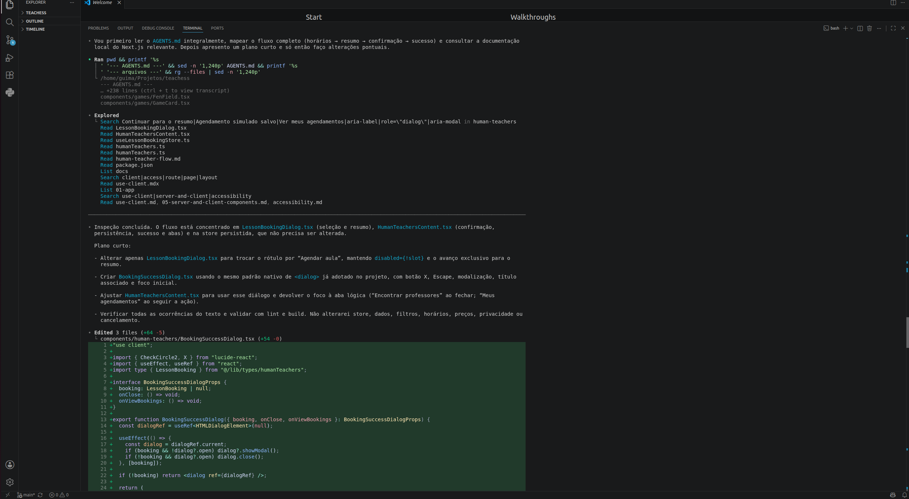

## 9. O que funcionou bem com o agente

- **Estrutura de componentes:** o Codex separou shell, navegação e componentes por domínio, evitando páginas monolíticas.
- **Rotas:** a evolução incremental manteve rotas estáticas e dinâmicas organizadas pelo App Router.
- **TypeScript:** entidades discriminadas para partidas externas e da plataforma ajudaram a expressar permissões e campos obrigatórios diferentes.
- **Zustand:** stores concentraram operações, persistência e validações que precisavam ser compartilhadas entre telas.
- **Tabelas, filtros e formulários:** o agente gerou rapidamente variações responsivas, validações, resumos e feedback de ação.
- **Estados explícitos:** carregamento, vazio, busca sem resultado, ID inexistente, análise ausente e recurso indisponível receberam tratamento visual.
- **Acessibilidade:** labels, mensagens de erro, foco visível, `aria-current`, tabs com teclado, botões por ícone identificados e diálogos nativos foram incorporados e refinados.
- **Responsividade:** grades, tabelas com overflow localizado, navegação móvel e limites de largura foram revisados durante o polimento.
- **Validação contínua:** lint e build expuseram erros de tipagem e integração que não seriam visíveis apenas olhando a interface.
- **Refatorações incrementais:** upload, chat, ciclo da partida, ranking e agendamento foram ajustados sem reescrever a arquitetura inteira.

O principal ganho foi velocidade para produzir e revisar muitos fluxos coerentes. Ainda assim, a qualidade resultou da combinação entre instruções precisas, documentação persistente, validações automatizadas disponíveis e revisão humana — não de autonomia irrestrita do agente.

## 10. O que não funcionou ou exigiu intervenção

### Sandbox e porta do servidor

Ao tentar executar `npm run dev`, o ambiente isolado bloqueou inicialmente a abertura da porta:

```text
Error: listen EPERM: operation not permitted 0.0.0.0:3000
```

O erro era uma restrição do sandbox, não um defeito da aplicação. Foi necessária autorização explícita do desenvolvedor para iniciar o servidor fora do ambiente isolado. Depois da autorização, a aplicação ficou acessível localmente em `http://localhost:3000`.

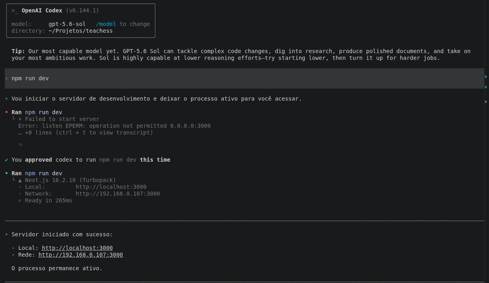


### Fonte externa durante o build

A configuração inicial utilizava `next/font` com a fonte Geist. Durante o build, o Next.js tentou obter arquivos externos, mas o ambiente de execução estava sem acesso à rede. Para tornar o projeto autocontido e permitir o build offline, a fonte externa foi removida e substituída por uma pilha de fontes do sistema.

Esse caso mostrou que uma dependência aparentemente visual também pode comprometer a compilação em ambientes restritos.

### Instância duplicada do servidor

Em uma das retomadas do desenvolvimento, uma instância anterior do servidor Next.js continuava utilizando a porta 3000. Uma nova execução foi direcionada para a porta 3001, e o Codex identificou o processo que permanecia ativo.

Foi necessário encerrar a instância antiga antes de continuar os testes. Esse problema não estava relacionado ao código da interface, mas ao estado do ambiente local.


### Inferência circular nas stores Zustand

Na primeira implementação da hidratação, funções `hydrate` referenciavam a própria store durante sua inicialização. O TypeScript detectou inferência circular e interpretou parte do retorno como `any`, fazendo o build falhar.

O problema só ficou evidente ao executar `npm run build`. A correção foi criar primeiro cada store e exportar a função de reidratação depois da declaração. O episódio reforçou que código gerado precisa ser compilado e revisto; aparência correta não garante tipagem correta.

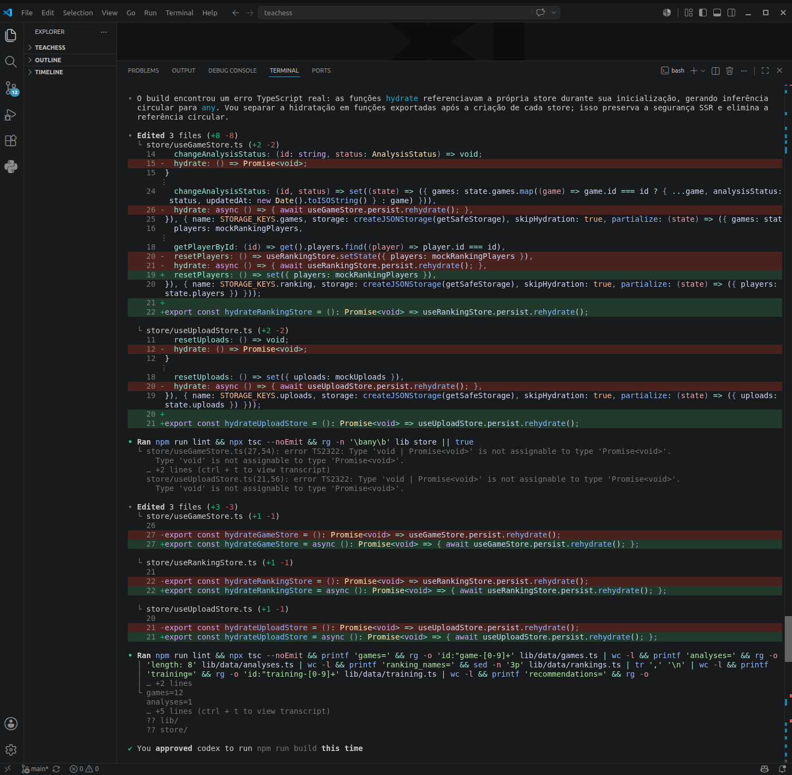

### Ajustes de regras entre módulos

À medida que o produto cresceu, regras inicialmente simplificadas precisaram ser refinadas. A separação entre rating atual e rating no momento da partida, a edição restrita de partidas oficiais, a exclusão exclusiva de partidas externas próprias e a exclusão de dados privados do ranking exigiram revisões cruzadas em tipos, stores, helpers e interface.

### Persistência e dados legados

Alterações nos modelos de partidas, uploads, chat e agendamentos exigiram migrações versionadas. Um exemplo foi a conversão de antigos agendamentos presenciais ou mistos para o fluxo exclusivamente online. Outro foi tornar a migração do chat tolerante a registros incompletos. Essas mudanças exigiram decisões humanas sobre como preservar dados sem inventar informação ausente.

### Revisão visual e de interação

O agente conseguiu inspecionar código e gerar builds, mas isso não substitui navegar em diferentes browsers, testar leitores de tela ou avaliar detalhes visuais. Ajustes de rolagem, alinhamento numérico, cabeçalhos, ciclo da partida e confirmação de agendamento surgiram em rodadas posteriores de revisão.

### Necessidade de prompts específicos

Solicitações amplas produziram estruturas úteis, mas regras sensíveis ficaram melhores quando os prompts explicitaram origem, privacidade, persistência, estados de erro e proibições. A revisão humana foi essencial para evitar que uma interface convincente sugerisse que análise, matchmaking, reconhecimento ou agendamento eram reais.


### O que eu faria diferente

Em uma nova implementação, as regras de negócio e os modelos de dados seriam consolidados antes da criação das primeiras telas. Isso reduziria ajustes posteriores relacionados a partidas externas, rating histórico, privacidade e permissões.

As stores persistidas também seriam versionadas desde a primeira implementação, com cenários de migração definidos previamente. A responsividade e a acessibilidade seriam verificadas desde o primeiro módulo, em vez de receberem uma revisão mais ampla apenas nas etapas finais.

Também seria criada mais cedo uma pequena suíte de testes automatizados para regras críticas, como cálculos do Dashboard, permissões das partidas, ranking e migrações do localStorage. Por fim, fontes e outros recursos externos seriam evitados desde o início em ambientes de desenvolvimento com acesso restrito à internet.


## 11. Qualidade, testes e validação

O projeto disponibiliza os seguintes scripts:

```bash
npm run dev     # servidor local
npm run lint    # ESLint
npm run build   # build de produção, TypeScript e geração de páginas
npm run start   # execução do build de produção
npm run test:get-position-context # testes determinísticos da função interna
npm run test:get-game-context # testes offline do runtime da partida autorizada
npm run test:position-context-tool-flow # testes offline de function calling
npm run test:game-context-tool-flow # definição, fluxo forçado e rota técnica, todos offline
npm run test:professor-context-tool-flow # seleção conjunta entre game, position ou nenhuma Tool, offline
npm run test:auto-position-context-tool-selection # testes offline da seleção automática
npm run test:position-context-tool-selection-runner # testes offline do runner de evals
npm run eval:position-context-tool-selection # runner real; exige opt-in explícito
npm run test:professor-context-tool-selection-evals # 57 testes offline do eval conjunto
npm run eval:professor-context-tool-selection # runner conjunto real; exige opt-in explícito
npm run test:professor-ia-prompts # seleção e invariantes offline das versões de prompt
npm run test:ai-tools # executa todas as suítes relacionadas à Tool
```

A infraestrutura de IA possuía historicamente uma suíte agregada com 121 testes automatizados aprovados antes de `get_game_context`. O runtime determinístico da partida executa 75 testes, e a definição OpenAI, o fluxo forçado e a rota técnica de partida executam 96 testes offline. O fluxo conjunto agora possui 125 testes, incluindo variantes reais de `ParsedResponse`, metadados adicionais, output não-array, diagnóstico sanitizado e bloqueio de mismatch. A suíte do eval conjunto possui 57 testes; isoladamente, o runner e a CLI executam 52, além dos cinco testes do conjunto canônico. `npm run test:professor-ia-prompts` executa mais quatro testes específicos das versões v2/v3. `npm run test:ai-tools` executa 478 testes únicos. Dentro do total permanecem as suítes específicas, os runners e a seleção automática; os comandos específicos e agregados se sobrepõem e não são somados novamente. Nenhum teste desta etapa alcança a rede ou a OpenAI.

Esses testes offline comprovam a lógica e a orquestração da infraestrutura. Separadamente, `E-020` observou 6/6 decisões corretas em sua amostra inicial, com uma repetição por caso. A execução posterior `E-021` observou 18/18 decisões corretas, ou 100% na amostra de 18 execuções, com três repetições por caso e a mesma decisão em 3/3 tentativas de cada caso. Não houve falsos positivos, falsos negativos ou erros técnicos nessa nova execução. Esses resultados pertencem a experimentos distintos e não devem ser somados automaticamente; a baixa diversidade ainda não comprova estabilidade estatística ou desempenho geral do LLM. O status `not_executed` permanece na definição canônica dos casos porque ela não é reescrita pelo histórico de execução.

Os casos canônicos de `E-022` conservam seu `status: "not_executed"` declarativo porque a definição congelada não é reescrita pelo histórico. Separadamente, a primeira execução real está registrada como `failed_integration` e inconclusiva: 12 erros técnicos, dez `FINAL_RESPONSE_OUTPUT_INVALID`, dois `TOOL_CONTEXT_MISMATCH`, `decisionAccuracy: null` e `completionRate: 0`. Não há accuracy observada nem conclusão sobre a capacidade do modelo.

Separadamente, `E-023` estabeleceu o primeiro baseline real tecnicamente válido da seleção conjunta: 12 execuções concluídas, 8 decisões corretas, 3 `wrong_tool`, 1 `false_positive` e 0 erros técnicos, correspondendo a 66,67% de `decision accuracy` nesta amostra curada, com uma repetição por caso. A qualidade ainda é limitada e indica a necessidade de iteração posterior de prompting e das descrições das Tools.

Mantendo `E-023/professor-ia-v2` intacto como baseline, `E-024` registrou a avaliação separada de `professor-ia-v3` com o mesmo runner, modelo, 12 casos e uma repetição: 11 acertos, 1 `wrong_tool`, nenhum falso positivo, falso negativo ou erro técnico, `decisionAccuracy` e `endToEndSuccessRate` de 91,67% e `completionRate` de 100%. O desvio ocorreu somente em `POSITION-SEL-004`, com `get_game_context` observado. Em contrapartida, os tokens por amostra completa aumentaram de aproximadamente 6.661 para 8.088 e a latência média de aproximadamente 19,1 s para 24,7 s. Os denominadores de telemetria diferem — 9 amostras em `E-023` e 11 em `E-024` — porque `wrong_tool` encerra o fluxo antes da segunda interação. O resultado é uma melhoria inicial na amostra curada, não precisão geral nem promoção automática da v3 para produção.

A revisão integrada documentada em [`docs/qa-checklist.md`](docs/qa-checklist.md) verificou as rotas pelo código e obteve sucesso em lint, build e `git diff --check`. Existem suítes unitárias direcionadas aos runtimes de `get_position_context` e `get_game_context`, executadas com o test runner nativo do Node.js e sem rede. Ainda não há uma suíte automatizada ampla para os demais módulos, nem testes de integração ou end-to-end; portanto, não se deve interpretar o build ou as suítes específicas como cobertura funcional completa.

### Testes manuais realizados

Durante o desenvolvimento, foram realizados testes manuais incrementais nos
principais fluxos da aplicação, incluindo:

- criação, edição, consulta e exclusão de partidas externas;
- edição de observações em partidas da plataforma;
- busca, filtros e ordenação das partidas;
- persistência dos dados após atualizar a página;
- navegação dos lances e estados da análise simulada;
- envio de imagem e abertura da posição no tabuleiro;
- conclusão de atividades e exercícios de treinamento;
- filtros, ordenação e perfis do ranking;
- movimentos legais, relógios, chat, salas e encerramento da partida local;
- histórico e respostas simuladas do Professor IA;
- busca, filtros, horários e agendamentos do Professor humano;
- tratamento de IDs inexistentes;
- navegação e responsividade em diferentes larguras de tela.

Esses testes foram executados manualmente durante cada iteração e complementados
por `npm run lint` e `npm run build`.

### Validações ainda recomendadas

Embora os fluxos principais tenham sido testados, ainda não foi executada uma
matriz completa envolvendo:

- todos os principais navegadores e sistemas operacionais;
- leitores de tela;
- auditoria especializada de contraste;
- dispositivos móveis físicos;
- testes automatizados unitários, de integração e end-to-end;
- cenários extensivos com dados legados de todas as versões das stores.

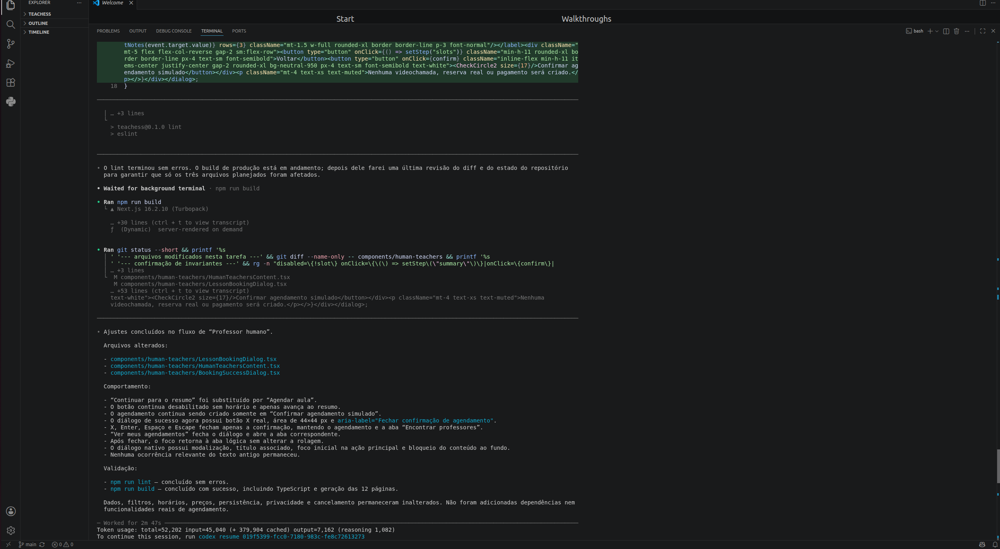

## 12. Como executar localmente

### Pré-requisitos

- Git;
- Node.js compatível com Next.js 16;
- npm;
- navegador moderno.

### Instalação

```bash
git clone https://github.com/GuilhermePontoAut/teachess.git
cd teachess
npm install
npm run dev
```

Acesse `http://localhost:3000`.

Para validar a versão de produção:

```bash
npm run lint
npm run build
npm run start
```

Não são necessárias variáveis de ambiente ou credenciais para navegar pela interface simulada. As rotas técnicas de LLM permanecem desabilitadas por padrão e só funcionam, em ambiente de desenvolvimento autorizado, com `OPENAI_API_KEY` e a flag server-side correspondente; elas não são necessárias para executar a experiência pública do protótipo.


## 13. Dados simulados

O TeaChess utiliza dados mockados e derivações determinísticas para
demonstrar seus fluxos de interface. Nesta versão:

- partidas, adversários e jogadores iniciais são fictícios;
- análises, precisões, erros e recomendações são simulados;
- o ranking não utiliza um sistema Elo real;
- o Professor IA utiliza templates locais, sem LLM;
- posições apresentadas após o envio de imagens não foram reconhecidas;
- professores, avaliações, preços e horários são fictícios;
- agendamentos não representam reservas reais;
- matchmaking, salas e chat funcionam somente como demonstração local;
- os dados persistidos ficam apenas no navegador por meio do `localStorage`.

As opções de restauração disponíveis em algumas páginas recuperam os mocks
originais e apagam as alterações locais daquele módulo.


## 14. Limitações assumidas

O TeaChess **ainda não possui**:

- integração de LLM com a interface real do Professor IA;
- endpoint final de IA com autenticação e rate limiting;
- Stockfish ou qualquer motor de xadrez;
- OCR, visão computacional ou reconhecimento real de posições;
- backend de produto ou banco de dados; as APIs existentes são somente rotas técnicas isoladas;
- autenticação, autorização ou segurança real;
- multiplayer, matchmaking, presença ou chat em rede;
- cálculo Elo real ou validação competitiva;
- armazenamento persistente de imagens;
- pagamentos, reservas, notificações ou videochamadas;
- professores ou jogadores reais.

Dados de partidas, análises, usuários, ranking, treinamento, posições reconhecidas, respostas, profissionais, avaliações, preços e horários são mocks ou derivações determinísticas locais. A interface demonstra a experiência pretendida; ela não comprova a operação de serviços futuros.

## 15. Evolução futura

Uma versão de produção exigiria, em etapas controladas:

1. backend com banco de dados, autenticação, autorização, auditoria e exclusão;
2. importação autorizada e validação de partidas externas;
3. infraestrutura multiplayer com comunicação em tempo real e relógios no servidor;
4. cálculo de rating e regras antifraude;
5. armazenamento privado e reconhecimento de posições com confirmação humana;
6. motor de xadrez para avaliações técnicas e variantes;
7. integração do modelo de linguagem à interface para explicações baseadas apenas em fatos autorizados e rastreáveis;
8. agenda, comunicação, pagamentos e consentimento de compartilhamento para professores humanos;
9. testes automatizados e auditorias de acessibilidade, privacidade e segurança.

O desenho conceitual da futura integração está em [`docs/future-ai-architecture.md`](docs/future-ai-architecture.md), e o fluxo de professores em [`docs/human-teacher-flow.md`](docs/human-teacher-flow.md).

## 16. Evidências do projeto

As capturas em [`docs/screenshots/`](docs/screenshots/) registram a evolução da interface, módulos funcionais, uso do Codex, falhas encontradas e validações. Elas complementam — mas não substituem — o código, o histórico do Git e o checklist de QA.


## 17. Relação com os critérios da atividade

### Endpoint funcional

A aplicação foi estruturada para publicação na Vercel. Todas as páginas
principais são navegáveis e os formulários, filtros, diálogos, tabuleiros,
gráficos e demais interações funcionam com dados locais simulados.

A aplicação está publicada na Vercel e pode ser acessada pelo endpoint informado no início deste README. O endereço foi validado em uma sessão anônima, sem dados previamente armazenados no navegador.

### Complexidade e ambição

O TeaChess possui múltiplos fluxos integrados: gerenciamento de partidas,
análise, upload de imagens, estudo de posições, treinamento, ranking,
demonstração de jogo, Professor IA e professores humanos. O projeto utiliza
rotas dinâmicas, persistência, migrações, formulários, filtros, gráficos,
tabuleiros e diferentes regras de privacidade.

### Repositório GitHub

O código está organizado por domínios, com componentes reutilizáveis,
stores, tipos, mocks, utilitários e documentação. O histórico registra
commits incrementais realizados ao longo do desenvolvimento.

### Documentação

Este README registra o problema, a solução, as escolhas arquiteturais,
as funcionalidades, as limitações, os acertos e os problemas encontrados
durante o uso do agente de codificação.

### Uso do agente de codificação

O OpenAI Codex foi utilizado extensivamente pelo terminal do VS Code para
inspeção, planejamento, implementação, refatoração e validação. As evidências
estão disponíveis em `docs/screenshots/`.


## 18. Conclusão

O TeaChess demonstra uma experiência integrada e coerente para organizar partidas e estudos de xadrez, com regras explícitas de origem, rating e privacidade. O protótipo entrega navegação e fluxos locais suficientemente completos para avaliar a proposta de produto, ao mesmo tempo que identifica visualmente tudo o que ainda é simulado.

O uso do OpenAI Codex acelerou implementação, refatoração e validação, mas os episódios de sandbox, tipagem, migração e consistência de regras mostram por que supervisão humana, documentação e testes continuam indispensáveis. A principal entrega acadêmica não é uma alegação de inteligência inexistente: é uma base frontend tipada, responsiva e evolutiva que torna visível como um produto real poderia ser construído com segurança em etapas futuras.


## 19. Autor

**Guilherme Magalhães Júnior**

GitHub: [GuilhermePontoAut](https://github.com/GuilhermePontoAut)
