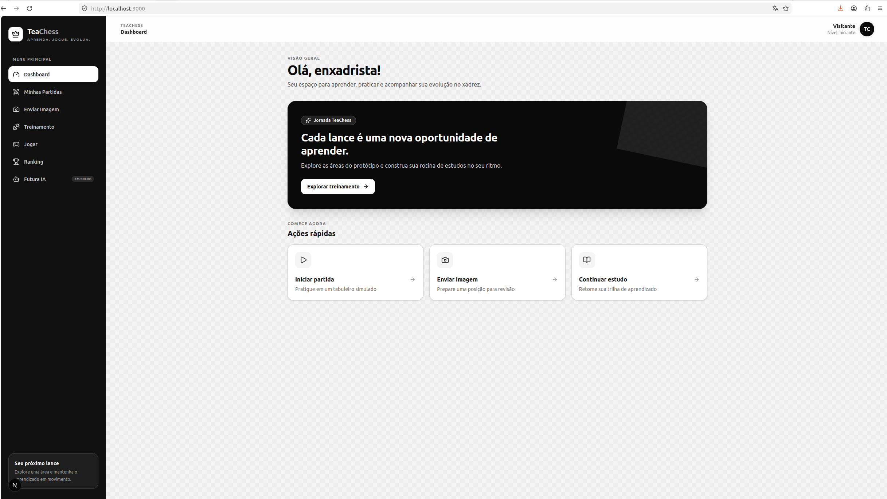

This is a [Next.js](https://nextjs.org) project bootstrapped with [`create-next-app`](https://nextjs.org/docs/app/api-reference/cli/create-next-app).

## Getting Started

First, run the development server:

```bash
npm run dev
# or
yarn dev
# or
pnpm dev
# or
bun dev
```

Open [http://localhost:3000](http://localhost:3000) with your browser to see the result.

You can start editing the page by modifying `app/page.tsx`. The page auto-updates as you edit the file.

This project uses [`next/font`](https://nextjs.org/docs/app/building-your-application/optimizing/fonts) to automatically optimize and load [Geist](https://vercel.com/font), a new font family for Vercel.

## Learn More

To learn more about Next.js, take a look at the following resources:

- [Next.js Documentation](https://nextjs.org/docs) - learn about Next.js features and API.
- [Learn Next.js](https://nextjs.org/learn) - an interactive Next.js tutorial.

You can check out [the Next.js GitHub repository](https://github.com/vercel/next.js) - your feedback and contributions are welcome!

## Deploy on Vercel

The easiest way to deploy your Next.js app is to use the [Vercel Platform](https://vercel.com/new?utm_medium=default-template&filter=next.js&utm_source=create-next-app&utm_campaign=create-next-app-readme) from the creators of Next.js.

Check out our [Next.js deployment documentation](https://nextjs.org/docs/app/building-your-application/deploying) for more details.


## O que não funcionou e exigiu intervenção

Durante os testes, o Codex tentou iniciar o servidor de desenvolvimento com:

```bash
npm run dev
```

A primeira execução falhou com o erro:

```text
Error: listen EPERM: operation not permitted 0.0.0.0:3000
```

O problema não estava no código da aplicação. O ambiente isolado do Codex bloqueou inicialmente a abertura da porta utilizada pelo servidor do Next.js.

Foi necessário autorizar explicitamente a execução do comando fora do sandbox. Após a autorização, o servidor iniciou corretamente em:

```text
http://localhost:3000
```

Essa situação demonstrou que, embora o agente consiga gerar e validar grande parte do código de forma autônoma, algumas operações do sistema ainda exigem supervisão e autorização manual do desenvolvedor.

### Evidência da limitação do sandbox

A imagem abaixo mostra a primeira tentativa de iniciar o servidor, o bloqueio da porta pelo sandbox e a execução posterior autorizada pelo usuário.


## Interface implementada

A identidade visual foi reformulada para utilizar predominantemente preto, branco e tons de cinza, fazendo referência às casas de um tabuleiro de xadrez.




### Erro de inferência circular nas stores Zustand

Durante a criação da camada de persistência local, o primeiro código gerado pelo Codex não passou no build de produção.

As funções `hydrate` referenciavam a própria store enquanto ela ainda estava sendo inicializada. Isso provocou uma inferência circular no TypeScript e fez o retorno ser interpretado como `any`.

O Codex identificou o problema após executar `npm run build` e reorganizou as funções de hidratação para que fossem exportadas somente depois da criação das stores.

Após a alteração, o lint e o build foram executados novamente para validar a correção.
