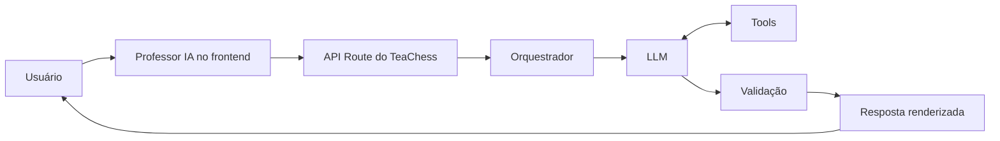

# Arquitetura inicial de LLM do TeaChess

Este documento registra o ponto de partida arquitetural para uma futura integração real do Professor IA. Ele não descreve uma integração já implementada nem resultados de testes ainda não realizados.

Para evitar que propostas sejam confundidas com fatos, as decisões são classificadas assim:

- **Decisão adotada:** direção arquitetural inicial aceita para orientar a primeira implementação e seus experimentos.
- **Hipótese inicial:** escolha provisória que precisa ser validada.
- **Alternativa considerada:** opção conhecida, mas não selecionada para o primeiro recorte.
- **Decisão pendente de experimento:** escolha que só poderá ser feita com evidências comparáveis.

## 1. Contexto atual

**Estado atual confirmado.** O Professor IA disponível na rota histórica `/futura-ia` usa templates locais, correspondência simples de termos e respostas simuladas. Nenhuma API de LLM, engine de xadrez, OCR ou serviço externo está integrada.

O TeaChess utiliza Next.js com App Router e TypeScript. A página da rota é um Server Component que renderiza a experiência interativa em Client Components. Partidas, posições enviadas e o histórico demonstrativo do Professor IA são coordenados por stores Zustand e persistidos no `localStorage` do navegador. As 30 interações mais recentes da demonstração são mantidas localmente.

A nova etapa deverá ser construída sobre a interface existente: seleção de contexto, perguntas, histórico, estados de carregamento e apresentação de respostas. A integração futura substituirá gradualmente a geração local simulada, sem tratar os mocks atuais como resultados de IA real.

## 2. Objetivo da integração

**Decisão adotada.** A primeira versão real do Professor IA deverá responder perguntas somente sobre:

- uma análise de partida selecionada;
- uma posição específica selecionada.

O objetivo inicial não é criar um chatbot de propósito geral. Toda pergunta deverá estar vinculada a um desses contextos autorizados, seguindo o recorte que a interface atual já oferece.

## 3. Arquitetura proposta

**Decisão adotada.** O fluxo conceitual será:

`Frontend → Route Handler seguro no servidor → camada de orquestração do Professor IA → LLM → tools quando necessárias → validação da resposta → interface`

O frontend enviará somente o contexto mínimo necessário e explicitamente autorizado para a pergunta. O Route Handler do App Router será o limite de entrada no servidor: validará a requisição e encaminhará dados normalizados à camada de orquestração. Essa camada decidirá quais tools disponibilizar, montará o contexto do modelo e validará o resultado antes de devolvê-lo à interface.

A chave do provedor nunca deverá ser enviada ao navegador, incluída em código cliente ou exposta por variável pública. A chamada ao provedor ocorrerá exclusivamente no servidor, usando variável de ambiente não pública.

**Alternativa considerada.** Chamar o provedor diretamente do frontend foi descartado por expor credenciais e retirar do servidor controles de validação, autorização, observabilidade e custo.

## 4. Framework

**Hipótese inicial.** Usar diretamente o SDK oficial do provedor que for escolhido e não adotar LangChain ou LangGraph na primeira versão.

Justificativas:

- haverá um único Professor IA;
- o conjunto inicial de tools é pequeno;
- o fluxo é controlado e possui dois tipos de contexto;
- menos abstrações reduzem a complexidade operacional;
- o debugging tende a ser mais simples;
- as chamadas ao modelo e às tools permanecem mais visíveis;
- a arquitetura fica mais fácil de explicar e avaliar.

**Alternativas consideradas.** LangChain e LangGraph permanecem opções conhecidas para fluxos com estado, ramificações ou orquestração mais complexa, mas não há evidência atual de que sejam necessários.

Essa hipótese poderá ser revista se experimentos demonstrarem uma necessidade real de orquestração mais complexa que não seja atendida com clareza pelo SDK oficial e por código de aplicação simples.

## 5. Provedor e modelo

**Decisão pendente de experimento.** Não será escolhido definitivamente um modelo nesta etapa. Os candidatos serão avaliados por categoria, sem presumir nomes ou versões:

- API comercial com suporte a tool calling e saída estruturada;
- modelo local via Ollama ou infraestrutura equivalente.

Critérios de comparação:

- qualidade das explicações;
- suporte a tools;
- suporte a saída estruturada;
- custo;
- latência;
- privacidade;
- facilidade de deploy;
- facilidade de integração ao Next.js;
- capacidade de seguir instruções.

**Modelo e provedor: decisão pendente de experimento e comparação.**

## 6. Escopo inicial

**Decisão adotada.** O Professor IA real atuará inicialmente apenas sobre análise de partida e posição específica selecionadas e autorizadas.

Ficam fora do escopo inicial:

- chatbot geral;
- busca na web;
- RAG;
- múltiplos agentes;
- Stockfish ou qualquer outra engine de xadrez;
- visão computacional;
- reconhecimento real de imagens;
- professor humano;
- ações destrutivas.

O recorte não autoriza o LLM a preencher a ausência de análise técnica. Quando os dados disponíveis forem simulados, incompletos ou não validados, essa limitação deverá permanecer explícita.

## 7. Tools candidatas

As tools abaixo são candidatas iniciais. Seus contratos, validações e lista final ainda deverão ser aprovados antes da implementação.

### `get_game_context`

**Hipótese inicial.** Recuperar somente os dados autorizados da partida selecionada.

Dados possíveis:

- jogadores;
- resultado;
- cor;
- PGN;
- FEN;
- abertura;
- ratings;
- observações;
- análise local disponível.

Campos opcionais devem preservar sua ausência. Ratings históricos não devem ser confundidos com rating atual, e partidas externas devem continuar privadas e fora das estatísticas oficiais.

### `get_position_context`

**Hipótese inicial.** Recuperar uma posição específica selecionada.

Dados possíveis:

- FEN;
- lado a jogar;
- origem;
- contexto;
- notas autorizadas.

Um FEN simulado ou ainda não confirmado deve ser identificado como tal; a tool não poderá promovê-lo silenciosamente a uma posição reconhecida ou validada.

### `get_player_pattern_summary`

**Hipótese inicial.** Calcular deterministicamente padrões sobre partidas autorizadas.

Dados possíveis:

- resultados;
- erros recorrentes;
- aberturas frequentes;
- tendências já presentes nos dados.

O cálculo deverá ocorrer em código, com regras testáveis e rastreáveis. O LLM poderá interpretar os resultados, mas não deverá inventar estatísticas, denominadores, frequências ou tendências.

### `get_legal_moves`

**Hipótese inicial.** Usar `chess.js` para validar uma posição e determinar seus movimentos legais.

`chess.js` não é engine de xadrez. Essa tool não avalia a posição, não determina o melhor lance e não produz variantes técnicas. O LLM não deverá inventar a legalidade de um movimento quando a tool não o confirmar.

### `get_training_progress`

**Candidata futura, ainda não aprovada.** Poderia recuperar progresso de treinamento autorizado, mas não integra o escopo inicial de análise de partida e posição específica. Sua inclusão dependerá de uma necessidade de produto demonstrada e de revisão de privacidade.

## 8. Estratégia de contexto

**Problema confirmado.** Os dados persistidos atualmente estão no navegador. Um Route Handler executado no servidor não acessa diretamente o `localStorage`.

**Hipótese inicial para o protótipo.** O frontend montará e enviará um snapshot mínimo, explicitamente autorizado e vinculado ao contexto selecionado. A camada do servidor disponibilizará esse snapshot às tools durante apenas aquela requisição. As tools só poderão consultar dados presentes na requisição; não terão acesso genérico ao navegador nem a outras stores.

Não deverá ser enviado todo o `localStorage` indiscriminadamente. O contrato da requisição deve usar allowlists de campos, limites de tamanho e validação de tipos. Observações e notas pessoais só serão incluídas quando necessárias e autorizadas para aquela pergunta.

**Evolução futura.** Com backend real, autenticação e persistência de servidor, o cliente poderá enviar identificadores e consentimentos, enquanto o servidor recuperará e autorizará os dados na fonte confiável. Isso mudará a arquitetura de contexto e reduzirá a confiança depositada no snapshot do navegador.

## 9. RAG

**Decisão adotada. Não usar RAG na primeira versão.**

Justificativas:

- o principal conhecimento variável já está em dados estruturados de partidas, análises e posições;
- tools permitem recuperação determinística e limitada ao contexto autorizado;
- ainda não existe uma base documental ampla que exija recuperação semântica.

**Alternativa considerada para o futuro.** RAG poderá fazer sentido quando houver uma biblioteca didática autorizada, livros, artigos, repertórios ou outros materiais pedagógicos com origem, direitos de uso e política de acesso definidos.

## 10. Agentes

**Decisão adotada. Utilizar um único Professor IA, sem arquitetura multi-agente.**

Justificativas:

- menor custo;
- menor latência;
- menor complexidade;
- o fluxo atual não exige especialização em múltiplos agentes;
- debugging e avaliação mais simples.

**Alternativa considerada.** Uma arquitetura multi-agente somente deverá ser reconsiderada se experimentos demonstrarem benefício mensurável que compense coordenação, custo, latência e novos modos de falha.

## 11. Estratégia de saída

**Hipótese inicial.** Usar resposta estruturada em vez de um único texto livre. Campos candidatos:

- `summary`;
- `observations`;
- `strengths`;
- `improvements`;
- `studyRecommendations`;
- `evidenceUsed`;
- `limitations`;
- `confidence`.

Esses campos procuram manter compatibilidade conceitual com a interface atual e tornar evidências e limitações visíveis. O schema final, tipos, obrigatoriedade, limites e semântica de `confidence` ainda não estão definidos.

## 12. Estratégia de prompting

**Hipóteses iniciais.** A primeira estratégia deverá considerar:

- system prompt versionado;
- seções claramente delimitadas;
- grounding explícito nos dados e resultados de tools;
- few-shot para casos críticos;
- tratamento explícito de dados insuficientes;
- proteção contra instruções presentes em notas, PGN ou outros dados do usuário;
- não solicitar chain-of-thought explícito;
- pedir justificativas curtas baseadas em evidências.

Notas, PGN, FEN, nomes, tags e demais conteúdos fornecidos pelo usuário devem ser delimitados e tratados como dados, nunca como instruções de maior prioridade. O modelo deverá poder declarar que não há evidência suficiente em vez de completar lacunas.

## 13. Parâmetros e experimentos

**Decisão pendente de experimento.** Não há valores finais definidos para parâmetros do modelo.

O plano inicial de experimentação deverá comparar, com um conjunto versionado de casos representativos:

- modelo;
- temperatura ou parâmetro equivalente;
- limite de saída;
- consistência entre execuções;
- latência;
- custo;
- aderência ao schema;
- uso correto de tools;
- alucinação e afirmações sem evidência.

Os casos deverão incluir dados completos, dados ausentes, PGN/FEN inválidos, posições sem FEN confirmado, tentativas de prompt injection em notas e perguntas que excedem o escopo. Métricas, critérios de aprovação e resultados devem ser registrados somente após sua execução. Valores finais só serão documentados depois dos testes; este documento não presume qualquer resultado.

## 14. Segurança e privacidade

**Decisões adotadas como requisitos:**

- manter a chave somente no servidor e em variáveis de ambiente não públicas;
- nunca enviar a chave ao frontend;
- minimizar o contexto enviado;
- validar e limitar inputs de requisições e tools;
- tratar conteúdo do usuário como dados, não como instruções;
- não revelar o system prompt;
- não inventar análise de engine, melhores lances ou avaliações técnicas;
- tratar timeout, indisponibilidade, resposta inválida e demais falhas do provedor;
- não registrar dados sensíveis desnecessariamente.

Também serão necessários controles de autorização reais quando houver autenticação e backend. Enquanto o protótipo depender de snapshots do navegador, o servidor deverá considerá-los dados não confiáveis, validá-los e evitar qualquer alegação de autorização que não possa verificar.

## 15. Decisões pendentes

As escolhas abaixo permanecem abertas:

- [ ] provedor;
- [ ] modelo;
- [ ] SDK oficial específico;
- [ ] schema final de entrada e saída;
- [ ] lista final e contratos das tools;
- [ ] parâmetros do modelo;
- [ ] limites de tokens de entrada e saída;
- [ ] estratégia de histórico da conversa;
- [ ] estratégia e limites de custos;
- [ ] política de logs, retenção e redaction;
- [ ] conjunto de evals, métricas e critérios de aprovação.

## 16. Diagrama

No contexto do App Router atual, “API Route” representa conceitualmente um Route Handler seguro no servidor.

## 17. Princípios arquiteturais

**Decisões adotadas.** A evolução do Professor IA seguirá estes princípios:

- fatos determinísticos devem vir de código ou tools;
- o LLM interpreta e explica, mas não substitui validação determinística;
- não adicionar complexidade sem necessidade comprovada;
- decisões de modelo, parâmetros e orquestração devem ser testadas;
- limitações e insuficiência de dados devem ser explicitadas;
- privacidade deve ser aplicada por minimização de contexto;
- conteúdo simulado, reconhecido, calculado e inferido deve permanecer distinguível;
- ausência de evidência não deve ser preenchida com uma resposta plausível.
