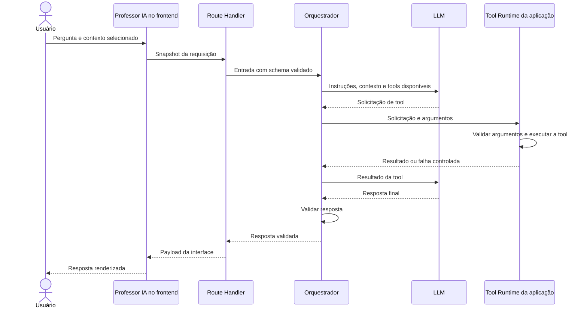

# Arquitetura inicial de LLM do TeaChess

Este documento registra o ponto de partida arquitetural para uma futura integração real do Professor IA. Ele não descreve uma integração já implementada nem resultados de testes ainda não realizados.

Para evitar que propostas sejam confundidas com fatos, as decisões são classificadas assim:

- **Decisão adotada:** direção arquitetural inicial aceita para orientar a primeira implementação e seus experimentos.
- **Hipótese inicial:** escolha provisória que precisa ser validada.
- **Alternativa considerada:** opção conhecida, mas não selecionada para o primeiro recorte.
- **Decisão pendente de experimento:** escolha que só poderá ser feita com evidências comparáveis.

## 1. Contexto atual

**Estado atual confirmado.** O Professor IA disponível na rota histórica `/futura-ia` usa templates locais, correspondência simples de termos e respostas simuladas. Nenhuma API de LLM, engine de xadrez, OCR ou serviço externo está integrada.

O TeaChess utiliza Next.js com App Router e TypeScript. A página da rota é um Server Component que renderiza a experiência interativa em Client Components. Partidas, posições enviadas e o histórico demonstrativo do Professor IA são coordenados por stores Zustand e persistidos no `localStorage` do navegador. As 30 interações mais recentes da demonstração são mantidas localmente.

A nova etapa deverá ser construída sobre a interface existente: seleção de contexto, perguntas, histórico, estados de carregamento e apresentação de respostas. A integração futura substituirá gradualmente a geração local simulada, sem tratar os mocks atuais como resultados de IA real.

## 2. Objetivo da integração

**Decisão adotada.** A primeira versão real do Professor IA deverá responder perguntas somente sobre:

- uma análise de partida selecionada;
- uma posição específica selecionada.

O objetivo inicial não é criar um chatbot de propósito geral. Toda pergunta deverá estar vinculada a um contexto explicitamente selecionado pelo usuário e permitido pelas regras locais do protótipo, seguindo o recorte que a interface atual já oferece. Essa seleção no frontend não constitui autorização verificável no servidor.

## 3. Arquitetura proposta

**Decisão adotada.** O fluxo conceitual será:

`Frontend → Route Handler no servidor → orquestrador → LLM → solicitação opcional de tool → orquestrador → Tool Runtime da aplicação → orquestrador → LLM → validação da resposta → interface`

O frontend enviará somente o contexto mínimo necessário e selecionado para a pergunta. O Route Handler do App Router será o limite de entrada no servidor: validará o schema da requisição e encaminhará dados normalizados à camada de orquestração. Essa validação não comprova identidade, propriedade ou permissão. A camada de orquestração decidirá quais tools disponibilizar, montará o contexto do modelo e validará o resultado antes de devolvê-lo à interface.

O modelo pode decidir ou solicitar o uso de uma tool, mas não executa diretamente código nem funções internas do TeaChess. O orquestrador recebe a solicitação, e o Tool Runtime da aplicação valida seus argumentos e executa a operação disponibilizada para aquela requisição. O resultado retorna ao orquestrador, que o envia ao modelo; somente então o modelo pode continuar o raciocínio operacional, solicitar outra operação dentro dos limites definidos ou produzir a resposta final.

**O modelo decide ou solicita o uso de uma tool, mas a execução real é responsabilidade do código da aplicação.**

**Decisão adotada como requisito.** O orquestrador deverá limitar tanto o número de tool calls por requisição quanto o número de ciclos entre modelo e tools. Loops não poderão continuar indefinidamente. Falhas repetidas de uma tool deverão encerrar o ciclo de maneira controlada, permitindo uma resposta que informe não ter sido possível concluir a operação. Os números e a política exata permanecem pendentes de experimento; os limites são necessários para controlar custo, latência, previsibilidade, prevenção de loops e experiência do usuário.

A chave do provedor nunca deverá ser enviada ao navegador, incluída em código cliente ou exposta por variável pública. A chamada ao provedor ocorrerá exclusivamente no servidor, usando variável de ambiente não pública.

**Alternativa considerada.** Chamar o provedor diretamente do frontend foi descartado por expor credenciais e retirar do servidor controles de validação, observabilidade e custo. Autorização real continuará dependendo de autenticação e de uma fonte confiável em backend futuro.

## 4. Framework

**Hipótese inicial.** Usar diretamente o SDK oficial do provedor que for escolhido e não adotar LangChain ou LangGraph na primeira versão.

Justificativas:

- haverá um único Professor IA;
- o conjunto inicial de tools é pequeno;
- o fluxo é controlado e possui dois tipos de contexto;
- menos abstrações reduzem a complexidade operacional;
- o debugging tende a ser mais simples;
- as chamadas ao modelo e às tools permanecem mais visíveis;
- a arquitetura fica mais fácil de explicar e avaliar.

**Alternativas consideradas.** LangChain e LangGraph permanecem opções conhecidas para fluxos com estado, ramificações ou orquestração mais complexa, mas não há evidência atual de que sejam necessários.

Essa hipótese poderá ser revista se experimentos demonstrarem uma necessidade real de orquestração mais complexa que não seja atendida com clareza pelo SDK oficial e por código de aplicação simples.

## 5. Provedor e modelo

**Decisão pendente de experimento.** Não será escolhido definitivamente um modelo nesta etapa. Os candidatos serão avaliados por categoria, sem presumir nomes ou versões:

- API comercial com suporte a tool calling e saída estruturada;
- modelo local via Ollama ou infraestrutura equivalente.

Critérios de comparação:

- qualidade das explicações;
- suporte a tools;
- suporte a saída estruturada;
- custo;
- latência;
- privacidade;
- facilidade de deploy;
- facilidade de integração ao Next.js;
- capacidade de seguir instruções.

Um modelo executado via Ollama no computador do desenvolvedor não fica automaticamente acessível ao TeaChess publicado na Vercel: o `localhost` da máquina local não pode ser acessado diretamente pelo deployment remoto. Se um modelo local for escolhido, será necessário decidir entre executar toda a demonstração localmente, expor uma infraestrutura de inferência acessível, hospedar o modelo em um serviço apropriado ou adotar outra arquitetura. Compatibilidade entre o local de inferência e o ambiente de deploy será, portanto, um critério explícito na comparação entre API comercial e modelo local.

**Modelo e provedor: decisão pendente de experimento e comparação.**

## 6. Escopo inicial

**Decisão adotada.** O Professor IA real atuará inicialmente apenas sobre análise de partida e posição específica explicitamente selecionadas pelo usuário e permitidas pelas regras locais do protótipo.

Ficam fora do escopo inicial:

- chatbot geral;
- busca na web;
- RAG;
- múltiplos agentes;
- Stockfish ou qualquer outra engine de xadrez;
- visão computacional;
- reconhecimento real de imagens;
- professor humano;
- ações destrutivas.

O recorte não autoriza o LLM a preencher a ausência de análise técnica. Quando os dados disponíveis forem simulados, incompletos ou não validados, essa limitação deverá permanecer explícita.

## 7. Tools candidatas

As tools abaixo são candidatas iniciais. Seus contratos, validações e lista final ainda deverão ser aprovados antes da implementação.

### `get_game_context`

**Hipótese inicial.** Recuperar somente os dados da partida selecionada que estejam presentes no snapshot daquela requisição ou que, em uma arquitetura futura, sejam obtidos de uma fonte confiável após verificação de acesso.

Dados possíveis:

- jogadores;
- resultado;
- cor;
- PGN;
- FEN;
- abertura;
- ratings;
- observações;
- análise local disponível.

Campos opcionais devem preservar sua ausência. Ratings históricos não devem ser confundidos com rating atual, e partidas externas devem continuar privadas e fora das estatísticas oficiais.

### `get_position_context`

**Hipótese inicial.** Recuperar uma posição específica selecionada.

Dados possíveis:

- FEN;
- lado a jogar;
- origem;
- contexto;
- notas selecionadas para aquela interação.

Um FEN simulado ou ainda não confirmado deve ser identificado como tal; a tool não poderá promovê-lo silenciosamente a uma posição reconhecida ou validada.

### `get_player_pattern_summary`

**Hipótese inicial.** Calcular deterministicamente padrões sobre as partidas selecionadas para aquela interação e disponíveis ao runtime.

Dados possíveis:

- resultados;
- erros recorrentes;
- aberturas frequentes;
- tendências já presentes nos dados.

O cálculo deverá ocorrer em código, com regras testáveis e rastreáveis. O LLM poderá interpretar os resultados, mas não deverá inventar estatísticas, denominadores, frequências ou tendências.

### `get_legal_moves`

**Hipótese inicial.** Usar `chess.js` para validar uma posição e determinar seus movimentos legais.

`chess.js` não é engine de xadrez. Essa tool não avalia a posição, não determina o melhor lance e não produz variantes técnicas. O LLM não deverá inventar a legalidade de um movimento quando a tool não o confirmar.

### `get_training_progress`

**Candidata futura, ainda não aprovada.** Poderia recuperar progresso de treinamento selecionado para a interação, mas não integra o escopo inicial de análise de partida e posição específica. Sua inclusão dependerá de uma necessidade de produto demonstrada e de revisão de privacidade e acesso.

## 8. Estratégia de contexto

**Problema confirmado.** Os dados persistidos atualmente estão no navegador. Um Route Handler executado no servidor não acessa diretamente o `localStorage`.

**Hipótese inicial para o protótipo.** O frontend montará e enviará um snapshot mínimo vinculado ao contexto explicitamente selecionado pelo usuário e permitido pelas regras locais. A camada do servidor disponibilizará esse snapshot às tools durante apenas aquela requisição. As tools só poderão consultar dados presentes na requisição; não terão acesso genérico ao navegador nem a outras stores.

O protótipo não possui autenticação real nem backend persistente confiável. A seleção feita pelo frontend não constitui autorização verificável no servidor, e todo snapshot recebido do navegador deverá ser tratado como dado não confiável. Validação de schema, allowlists e regras locais reduzem entradas inválidas e exposição acidental, mas não equivalem a autenticação ou autorização.

Não deverá ser enviado todo o `localStorage` indiscriminadamente. O contrato da requisição deve usar allowlists de campos, limites de tamanho e validação de tipos. Observações e notas pessoais só serão incluídas quando necessárias e selecionadas para aquela pergunta. Esses controles preservam conceitualmente a minimização e a privacidade do TeaChess, sem serem apresentados como segurança real.

**Decisão pendente de experimento. Comparar o envio direto do contexto principal com sua recuperação por tool.** As duas alternativas deverão permanecer disponíveis para avaliação; por isso, `get_game_context` e `get_position_context` não são removidas da lista de candidatas.

### Alternativa A — contexto principal enviado diretamente

O frontend envia a pergunta, o contexto selecionado e os dados mínimos necessários da partida ou posição. O modelo já recebe o contexto principal, e as tools ficam reservadas para informações adicionais, como padrões históricos, movimentos legais ou futuras consultas externas.

Vantagens possíveis:

- fluxo mais simples;
- menos uma rodada de tool calling;
- menor latência operacional.

Desvantagens possíveis:

- maior contexto enviado antecipadamente;
- menor seletividade no acesso aos dados.

### Alternativa B — contexto principal recuperado por tool

O frontend envia um snapshot validado quanto ao schema ou identificadores disponíveis para aquela requisição, e o modelo solicita `get_game_context` ou `get_position_context`. Enquanto não houver backend confiável, identificadores ou snapshots vindos do navegador continuam sem comprovar identidade, propriedade ou permissão.

Vantagens possíveis:

- o modelo solicita apenas os dados necessários;
- o uso do contexto fica explícito;
- pode melhorar a auditabilidade.

Desvantagens possíveis:

- mais complexidade;
- mais uma etapa;
- possível aumento de latência;
- possível redundância quando o usuário já selecionou explicitamente uma única partida ou posição.

A escolha será feita por experimento, considerando simplicidade, latência, tamanho do contexto, número de tool calls, auditabilidade e necessidade real de recuperação. Nenhuma das alternativas possui resultado presumido neste documento.

**Evolução futura.** Com backend real, autenticação e persistência de servidor, o cliente poderá enviar identificadores e consentimentos, enquanto o servidor validará identidade, propriedade e permissões antes de recuperar os dados em uma fonte confiável. Isso mudará a arquitetura de contexto e reduzirá a confiança depositada no snapshot do navegador.

## 9. RAG

**Decisão adotada. Não usar RAG na primeira versão.**

Justificativas:

- o principal conhecimento variável já está em dados estruturados de partidas, análises e posições;
- tools permitem recuperação determinística e limitada aos dados selecionados para a interação;
- ainda não existe uma base documental ampla que exija recuperação semântica.

**Alternativa considerada para o futuro.** RAG poderá fazer sentido quando houver uma biblioteca didática com livros, artigos, repertórios ou outros materiais pedagógicos cuja origem, direitos de uso e política de acesso estejam definidos.

## 10. Agentes

**Decisão adotada. Utilizar um único Professor IA, sem arquitetura multi-agente.**

Justificativas:

- menor custo;
- menor latência;
- menor complexidade;
- o fluxo atual não exige especialização em múltiplos agentes;
- debugging e avaliação mais simples.

**Alternativa considerada.** Uma arquitetura multi-agente somente deverá ser reconsiderada se experimentos demonstrarem benefício mensurável que compense coordenação, custo, latência e novos modos de falha.

## 11. Estratégia de saída

**Hipótese inicial.** Usar resposta estruturada em vez de um único texto livre. Campos candidatos:

- `summary`;
- `observations`;
- `strengths`;
- `improvements`;
- `studyRecommendations`;
- `evidenceUsed`;
- `limitations`;
- `confidence`.

Esses campos procuram manter compatibilidade conceitual com a interface atual e tornar evidências e limitações visíveis. O schema final, tipos, obrigatoriedade, limites e semântica de `confidence` ainda não estão definidos.

A autoavaliação de confiança de um LLM não é uma medida confiável de correção. Um valor como `confidence: high` não prova que a resposta esteja correta.

**Hipótese inicial.** Comparar duas opções, sem definir ainda o schema final:

- **Opção A — `confidence` informado pelo modelo:** preserva uma autoavaliação explícita, mas não deve ser interpretado como probabilidade calibrada nem como evidência de correção.
- **Opção B — `evidenceStatus`:** usa valores como `sufficient`, `partial` e `insufficient` e poderá ser calculado total ou parcialmente pela aplicação a partir de evidências verificáveis.

Entre as evidências candidatas para `evidenceStatus` estão a existência de PGN ou FEN; a distinção entre FEN confirmado e simulado; a disponibilidade ou ausência de análise técnica; a quantidade de partidas considerada; os resultados de tools; e a presença ou ausência dos dados necessários.

**Decisão pendente de experimento. Definir se `confidence` será mantido, substituído ou complementado por `evidenceStatus`.**

## 12. Estratégia de prompting

**Hipóteses iniciais.** A primeira estratégia deverá considerar:

- system prompt versionado;
- seções claramente delimitadas;
- grounding explícito nos dados e resultados de tools;
- few-shot para casos críticos;
- tratamento explícito de dados insuficientes;
- proteção contra instruções presentes em notas, PGN ou outros dados do usuário;
- não solicitar chain-of-thought explícito;
- pedir justificativas curtas baseadas em evidências.

Notas, PGN, FEN, nomes, tags e demais conteúdos fornecidos pelo usuário devem ser delimitados e tratados como dados, nunca como instruções de maior prioridade. O modelo deverá poder declarar que não há evidência suficiente em vez de completar lacunas.

**Decisão adotada como requisito.** O modelo deverá receber a instrução comportamental de não atender solicitações para revelar instruções internas. Ainda assim, o system prompt não deverá ser tratado como um cofre de segredos. Nenhuma chave de API, credencial, token, segredo de infraestrutura ou dado sensível poderá ser colocado nele. Instruções contra revelação são apenas uma camada comportamental e não substituem boas práticas de segurança; segredos deverão permanecer em variáveis de ambiente e infraestrutura apropriada.

## 13. Parâmetros e experimentos

**Decisão pendente de experimento.** Não há valores finais definidos para parâmetros do modelo.

O plano inicial de experimentação deverá comparar, com um conjunto versionado de casos representativos:

- modelo;
- temperatura ou parâmetro equivalente;
- limite de saída;
- consistência entre execuções;
- latência;
- custo;
- aderência ao schema;
- uso correto de tools;
- alucinação e afirmações sem evidência.

A avaliação de uso de tools deverá distinguir pelo menos:

- **Tool necessária não utilizada:** por exemplo, o modelo responde sobre padrões históricos sem consultar os dados necessários.
- **Tool desnecessária utilizada:** por exemplo, o modelo realiza consultas extras para responder a uma pergunta simples para a qual já possuía contexto suficiente.

Os experimentos deverão observar a necessidade de tool, a seleção da tool correta, a validade dos argumentos, chamadas desnecessárias, chamadas ausentes, falhas de tool e o comportamento após erro. Poderão ser avaliadas conceitualmente a precisão no uso de tools e a cobertura do uso necessário de tools, sem definir ainda uma métrica matemática final.

Também deverão ser comparados limites para o número máximo de tool calls por requisição, o número máximo de ciclos de orquestração e o comportamento após falhas repetidas. Nenhum valor final é presumido nesta etapa.

Os casos deverão incluir dados completos, dados ausentes, PGN/FEN inválidos, posições sem FEN confirmado, tentativas de prompt injection em notas e perguntas que excedem o escopo. Métricas, critérios de aprovação e resultados devem ser registrados somente após sua execução. Valores finais só serão documentados depois dos testes; este documento não presume qualquer resultado.

## 14. Segurança e privacidade

**Decisões adotadas como requisitos:**

- manter a chave somente no servidor e em variáveis de ambiente não públicas;
- nunca enviar a chave ao frontend;
- minimizar o contexto enviado;
- validar e limitar inputs de requisições e tools;
- tratar conteúdo do usuário como dados, não como instruções;
- não revelar o system prompt;
- não armazenar segredos ou dados sensíveis no system prompt;
- não inventar análise de engine, melhores lances ou avaliações técnicas;
- tratar timeout, indisponibilidade, resposta inválida e demais falhas do provedor;
- impor limites de tool calls e ciclos de orquestração, encerrando loops e falhas repetidas de forma controlada;
- não registrar dados sensíveis desnecessariamente.

Também serão necessários controles de autorização reais quando houver autenticação e backend. Enquanto o protótipo depender de snapshots do navegador, o servidor deverá considerá-los dados não confiáveis, validá-los e evitar qualquer alegação de autorização que não possa verificar.

## 15. Decisões pendentes

As escolhas abaixo permanecem abertas:

- [ ] provedor;
- [ ] modelo;
- [ ] SDK oficial específico;
- [ ] schema final de entrada e saída;
- [ ] lista final e contratos das tools;
- [ ] contexto principal enviado diretamente ou recuperado por tool;
- [ ] `confidence`, `evidenceStatus` ou combinação;
- [ ] parâmetros do modelo;
- [ ] limites de tokens de entrada e saída;
- [ ] número máximo de tool calls por requisição;
- [ ] número máximo de ciclos de orquestração;
- [ ] comportamento após falha repetida de uma tool;
- [ ] estratégia de histórico da conversa;
- [ ] estratégia e limites de custos;
- [ ] política de logs, retenção e redaction;
- [ ] conjunto de evals, métricas e critérios de aprovação.

## 16. Diagrama

### Estado técnico isolado da Etapa 7C-A

Em uma rota exclusivamente técnica, a aplicação agora autoriza no máximo um contexto discriminado por requisição — partida, posição ou nenhum — e pode oferecer simultaneamente as definições de `get_game_context` e `get_position_context`. O modelo seleciona uma Tool ou nenhuma, mas autorização do snapshot, compatibilidade entre Tool e contexto, argumentos e execução continuam validados server-side. Essa implementação possui duas interações fixas e não cria loop ou abstração genérica de agente. Ela permanece desconectada da interface pública e ainda não constitui avaliação real da qualidade de seleção do modelo.

O diagrama representa o caminho conceitual com tool calling. Em fluxos futuros, uma resposta sem Tool poderá eventualmente encerrar após a primeira chamada. No fluxo técnico da Etapa 7C-A, porém, tanto a decisão com Tool quanto a decisão sem Tool seguem para uma segunda chamada estruturada, preservando exatamente duas interações lógicas. Em nenhum dos casos há ligação na qual o LLM execute diretamente a Tool: solicitação, validação de argumentos e execução passam pelo orquestrador e pelo runtime da aplicação.

## 17. Princípios arquiteturais

**Decisões adotadas.** A evolução do Professor IA seguirá estes princípios:

- fatos determinísticos devem vir de código ou tools;
- o LLM interpreta e explica, mas não substitui validação determinística;
- não adicionar complexidade sem necessidade comprovada;
- decisões de modelo, parâmetros e orquestração devem ser testadas;
- limitações e insuficiência de dados devem ser explicitadas;
- privacidade deve ser aplicada por minimização de contexto;
- conteúdo simulado, reconhecido, calculado e inferido deve permanecer distinguível;
- ausência de evidência não deve ser preenchida com uma resposta plausível.
