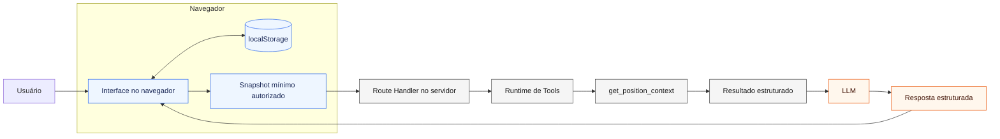

# Tools do Professor IA: contrato inicial de `get_position_context`

Este documento registra a investigação da Etapa 6A e o contrato candidato da primeira Tool do TeaChess. Ele é exclusivamente documental: `get_position_context` ainda não foi implementada, registrada na Responses API nem conectada ao Professor IA. Nenhuma chamada ao provedor faz parte desta etapa.

## 1. Classificação das definições

### Decisões adotadas

- `get_position_context` será a primeira Tool candidata do Professor IA.
- A Tool poderá consultar somente o snapshot mínimo da posição específica selecionada e autorizada pela aplicação para aquela requisição.
- O argumento inicial recomendado é apenas `positionContextId`, validado contra o único snapshot autorizado.
- FEN, confirmação, origem e demais fatos não serão aceitos como argumentos produzidos pelo modelo.
- Presença, validade, aceitação pela biblioteca, confirmação da origem e suficiência para análise serão estados separados.
- Quando nenhuma posição estiver selecionada, a definição de `get_position_context` preferencialmente não será disponibilizada ao modelo.
- Toda execução bem-sucedida terá um snapshot autorizado; tentativa de execução sem esse snapshot retornará `SNAPSHOT_MISSING`, nunca um sucesso que represente ausência de contexto.
- O contrato será implementado e testado deterministicamente antes de qualquer registro em function calling.

### Hipóteses iniciais

- O frontend normalizará `UploadedPosition` para um snapshot menor, próprio da integração de servidor.
- A futura implementação usará `validateFen` e/ou a construção de `Chess` do `chess.js` 1.4.0 para registrar se o FEN é aceito pela biblioteca.
- O resultado poderá usar os estados candidatos descritos neste documento; nomes e limites serão congelados somente na etapa de implementação e testes.
- Enquanto não houver um campo explícito de confirmação, o estado seguro será `not_recorded`, nunca `confirmed` por inferência.

### Alternativas consideradas

- Tool sem argumentos, vinculada implicitamente ao único snapshot da requisição.
- Tool com `positionContextId`, vinculada ao mesmo snapshot, mas com verificação explícita de correspondência.
- Enviar a posição completa diretamente ao modelo, sem recuperá-la por Tool.
- Enviar todo o estado da store ou todo o `localStorage`, alternativa descartada por violar minimização e isolamento entre posições.

### Decisões ainda pendentes

- O schema definitivo de runtime e a biblioteca usada para validá-lo.
- Os limites exatos de tamanho de identificadores, FEN, detalhes de origem e mensagens de erro.
- A futura adição de um campo explícito de confirmação ao modelo de dados.
- Os detalhes da checagem estrutural determinística usada para calcular `syntaxStatus`.
- Se o contexto principal continuará sendo recuperado por Tool depois de medições de latência, custo e auditabilidade.
- Autenticação, autorização verificável e recuperação a partir de uma fonte confiável de servidor.

### Fora do escopo atual

- implementar a função TypeScript;
- registrar a Tool na Responses API;
- executar function calling ou chamar a OpenAI;
- implementar `get_legal_moves`;
- usar Stockfish ou qualquer engine;
- usar RAG;
- conectar o Professor IA à interface;
- criar banco de dados, autenticação ou backend de produto;
- alterar a persistência atual;
- criar ou alterar prompts, evals existentes ou o schema de resposta final.

## 2. Função interna e Tool não são a mesma coisa

Uma futura função TypeScript será código determinístico da aplicação. Ela receberá valores já validados pelo runtime e consultará o snapshot disponibilizado naquela execução.

A definição de Tool será o nome, a descrição e o JSON Schema apresentados ao modelo. Essa definição informa que uma capacidade existe e quais argumentos podem ser solicitados; ela não entrega ao modelo acesso ao código.

A solicitação de Tool será uma saída estruturada do modelo, por exemplo o nome `get_position_context` e um `positionContextId`. O modelo não executa diretamente a função e não lê memória, stores ou `localStorage`.

A execução real será responsabilidade da aplicação. O runtime validará o nome e os argumentos, verificará se o identificador corresponde ao snapshot autorizado, decidirá se a operação é permitida e só então chamará a função TypeScript.

O resultado da Tool será um objeto estruturado criado pela aplicação e devolvido ao modelo. Somente depois desse retorno o modelo poderá interpretar os fatos e produzir a resposta final do Professor IA.

```text
definição apresentada ao modelo
→ solicitação produzida pelo modelo
→ validação e autorização pela aplicação
→ execução da função TypeScript
→ resultado estruturado devolvido ao modelo
```

Argumentos válidos não constituem autorização. A autorização é definida pela aplicação e aplicada pelo servidor/runtime.

## 3. Por que começar por `get_position_context`

O Professor IA atual já possui o conceito de posição específica: `components/future-ai/ContextSelector.tsx` permite escolher `saved-position`, e `components/future-ai/AiProfessorDemo.tsx` resolve o ID escolhido contra as posições privadas do usuário atual.

Os evals documentados em `docs/llm-prompting-evals.md` mostraram que dado presente, dado válido, dado confirmado, dado confiável e evidência suficiente não são equivalentes. O `EV-006`, em particular, preservou como requisito a diferença entre FEN interpretável e posição automática ainda não confirmada.

Hoje o contexto está no navegador e é persistido em `localStorage`. Uma Tool permite entregar ao modelo um resultado pequeno e estruturado, com os qualificadores necessários, sem dar acesso livre às posições armazenadas. Ela também estabelece a base para uma futura `get_legal_moves`, que poderá consumir apenas uma posição previamente validada e autorizada. `get_legal_moves` não faz parte desta etapa.

## 4. Estado real da posição no TeaChess

### 4.1 Criação e modelo de dados

- A rota de upload é `app/enviar-imagem/page.tsx` e renderiza `components/uploads/UploadContent.tsx`.
- `components/uploads/UploadForm.tsx`, `components/uploads/UploadDropzone.tsx` e `components/uploads/uploadForm.ts` coletam uma imagem e os campos do formulário.
- `components/uploads/UploadContent.tsx` cria a posição com `crypto.randomUUID()`, metadados do formulário e um FEN escolhido deterministicamente por `imageOrigin`. Esse FEN não é extraído da imagem.
- O tipo real é `UploadedPosition`, em `lib/types/chess.ts`.
- Os registros iniciais são mocks de `lib/data/uploads.ts`.

Campos reais de `UploadedPosition`:

| Grupo | Campos existentes |
| --- | --- |
| Identificação e acesso local | `id`, `ownerUserId`, `visibility` |
| Descrição e origem | `title`, `imageOrigin`, `sourceContext`, `sourceDetails`, `date`, `description`, `linkedGameId`, `tags` |
| Metadados da imagem | `fileName`, `fileSize`, `mimeType` |
| Reconhecimento demonstrativo | `simulatedDetectedFen`, `simulatedSideToMove`, `simulatedConfidence`, `recognitionStatus` |
| Estudo | `favorite`, `personalStudyNotes` |
| Migração e tempo | `migrationNote`, `createdAt`, `updatedAt` |

Não existe atualmente no modelo de dados um campo de confirmação do usuário. Também não existem campos separados de validade sintática do FEN, legalidade/aceitação pela biblioteca, confiabilidade da origem ou suficiência para análise.

### 4.2 Armazenamento e persistência

- `store/useUploadStore.ts` mantém `uploads: UploadedPosition[]`, permite criar, excluir e atualizar favorito/anotação e executa a migração da versão 3.
- A store usa `persist`, `createJSONStorage(getSafeStorage)`, `skipHydration: true` e a chave `teachess-uploads-v1` declarada em `lib/storage/storage.ts`.
- `lib/storage/storage.ts` devolve `window.localStorage` no navegador e armazenamento em memória durante execução no servidor.
- A persistência inclui somente `{ uploads }`.
- A imagem real, `File`, `Blob`, base64 e object URL não são persistidos. `store/useUploadStore.ts` mantém previews apenas em um `Map` em memória durante a sessão.

Portanto, há referência persistida à imagem por nome, tipo MIME e tamanho, mas não há imagem persistida nem URL durável. Após recarregar, `components/study/PositionSourceCard.tsx` informa que a imagem original não está disponível.

### 4.3 Identificação, seleção e abertura no tabuleiro

- `UploadedPosition.id` é um identificador estável dentro da persistência atual: mocks usam valores como `upload-01`, e novos registros usam UUID do navegador.
- Na página do Professor IA, `components/future-ai/ContextSelector.tsx` cria `FutureAiContextRef` com `type: "saved-position"` e o `id` da posição.
- `components/future-ai/AiProfessorDemo.tsx` guarda a seleção em estado React local e resolve a posição com `positions.find(item => item.id === context.id)`.
- Não há uma posição globalmente selecionada na store. A seleção ativa do Professor IA não é persistida; somente as interações históricas guardam a referência de contexto em `store/useFutureAiDemoStore.ts`.
- A lista, o diálogo e a confirmação de upload abrem `/estudo/posicoes/[id]`; os links estão em `components/uploads/SavedUploads.tsx`, `components/uploads/UploadDetailsDialog.tsx`, `components/uploads/FutureImageAnalysis.tsx` e `components/uploads/UploadContent.tsx`.
- `app/estudo/posicoes/[id]/page.tsx` entrega o parâmetro a `components/study/PositionStudyContent.tsx`, que reidrata a store e procura uma posição cujo `id` e `ownerUserId` correspondam.
- `components/study/PositionBoard.tsx` constrói `new Chess(originalFen)` e permite movimentos legais locais. O FEN resultante dos movimentos fica apenas no estado do componente; ele não substitui `simulatedDetectedFen` na store e não é o contexto selecionado pelo Professor IA.

### 4.4 FEN, origem, confirmação e natureza dos dados

- Há FEN de posição no campo nullable `simulatedDetectedFen`.
- Há também FEN em partidas e análises, mas esses dados pertencem a outros contextos e não integram o snapshot desta Tool.
- `imageOrigin`, `sourceContext` e `sourceDetails` registram a origem informada para a imagem/posição.
- `recognitionStatus` registra o estado demonstrativo (`demo_available`, `preview_only` ou `not_processed`), não uma confirmação humana.
- `simulatedSideToMove` existe, mas o lado também pode ser derivado deterministicamente do segundo campo de um FEN aceito.
- `simulatedConfidence` é um número mockado da demonstração; não comprova correção e não deve entrar no contrato inicial da Tool.
- Não existe atualmente no modelo de dados um campo de confirmação do usuário.
- Os FENs criados pelo upload são mocks determinísticos. Não há OCR, visão computacional ou reconhecimento real.
- Os mocks de `lib/data/uploads.ts` também contêm FENs e metadados simulados.
- `createdAt` e `updatedAt` existem, mas não são necessários para responder sobre a posição e não devem atravessar inicialmente a fronteira.
- `linkedGameId`, descrição, tags e anotações pessoais existem, mas não são necessários para o contrato mínimo inicial. As notas não devem ser enviadas por padrão.

## 5. Fronteira de autorização

Fluxo planejado:

```text
frontend
→ identifica a posição atualmente selecionada
→ cria snapshot mínimo autorizado
→ envia o snapshot ao Route Handler
→ o servidor disponibiliza somente esse snapshot ao runtime da Tool
→ get_position_context retorna apenas o contexto autorizado
```

O Route Handler executa no servidor e não consegue ler diretamente o `localStorage` do navegador. A Tool não navegará livremente pelos dados do navegador, não receberá toda a store e não receberá todo o `localStorage`. Somente a posição selecionada, normalizada para uma allowlist mínima, atravessará a fronteira.

No protótipo sem autenticação e backend confiável, o snapshot enviado pelo navegador continuará sendo dado não confiável. Validar seu schema reduz entradas inválidas e exposição acidental, mas não prova identidade, propriedade ou permissão. A autorização conceitual para aquela chamada é definida pela aplicação; nunca pelo modelo e nunca pela simples presença de um argumento.

## 6. Formato inicial dos argumentos

### Alternativa A — sem argumentos

```json
{}
```

É adequada a uma única posição ativa, reduz a chance de o modelo inventar identificadores e possui o menor contrato possível. Como desvantagem, a correlação entre solicitação, snapshot e logs fica implícita.

### Alternativa B — identificador opaco

```json
{
  "positionContextId": "upload-01"
}
```

Permite correlação explícita e rejeição controlada de um ID divergente. O valor continua sem conceder acesso: deve corresponder exatamente ao único snapshot já autorizado.

### Decisão recomendada

Adotar a alternativa B. O código atual já possui `UploadedPosition.id`, persiste esse valor, usa-o nas rotas e o utiliza para selecionar a posição no Professor IA. Portanto, o identificador é estável e útil; não é necessário criar um ID artificial. O modelo deverá tratá-lo como token opaco, sem extrair significado de seu formato.

Embora haja apenas uma posição selecionada por requisição, o ID já faz parte do fluxo real e melhora rastreabilidade. A aplicação deverá fornecer ao modelo somente a referência da posição autorizada e comparar o argumento com o `positionContextId` do snapshot. Um ID diferente produz erro de autorização, não uma busca em outras posições.

O ID já existe no modelo atual, mas não concede autorização. Ele deve corresponder exatamente ao único snapshot autorizado. Se houver divergência, o runtime não pesquisará a store nem tentará localizar outras posições: retornará `POSITION_CONTEXT_NOT_AUTHORIZED`.

## 7. Contrato candidato de entrada da Tool

```json
{
  "type": "object",
  "properties": {
    "positionContextId": {
      "type": "string",
      "minLength": 1,
      "maxLength": 128,
      "description": "Identificador opaco da única posição autorizada para esta requisição."
    }
  },
  "required": ["positionContextId"],
  "additionalProperties": false
}
```

O limite de 128 caracteres é uma hipótese inicial a confirmar na implementação. O schema não aceita FEN, origem, `confirmationStatus`, notas, IDs alternativos nem propriedades extras. O modelo não pode alterar o snapshot nem escolher arbitrariamente outro dado do navegador.

A Tool não deve receber uma resposta natural do modelo como argumento. Pergunta, instruções e resposta final pertencem a outras partes do fluxo.

## 8. Snapshot interno autorizado

O schema de argumentos acima é apresentado ao modelo. O snapshot abaixo é interno, enviado pelo frontend ao Route Handler e disponibilizado ao runtime; ele não é argumento da Tool.

Forma candidata:

```ts
interface AuthorizedPositionSnapshot {
  positionContextId: string;
  fen: string | null;
  imageOrigin: "physical_board_photo" | "online_game_screenshot";
  sourceContext:
    | "in_person_game"
    | "tournament"
    | "club"
    | "personal_study"
    | "teachess"
    | "chess.com"
    | "lichess"
    | "other";
  recognitionStatus: "demo_available" | "preview_only" | "not_processed";
  dataNature: "simulated_demo";
  confirmationStatus: "confirmed" | "unconfirmed" | "not_recorded";
}
```

O tipo é proposta documental, não código existente.

| Campo candidato | Situação no código atual | Decisão inicial |
| --- | --- | --- |
| `positionContextId` | Existe como `UploadedPosition.id` | Incluir |
| `fen` | Existe como `simulatedDetectedFen: string \| null` | Incluir, normalizando o nome e preservando `null` |
| `imageOrigin` | Existe | Incluir |
| `sourceContext` | Existe | Incluir |
| `sourceDetails` | Existe | Não incluir inicialmente; texto livre não é necessário para os estados básicos |
| `recognitionStatus` | Existe | Incluir para distinguir disponibilidade demonstrativa; não confundir com confirmação |
| `dataNature` | Pode ser derivado deterministicamente do campo `simulatedDetectedFen` e do fluxo atual | Incluir como `simulated_demo` enquanto esse for o único fluxo |
| `confirmationStatus` | Não existe atualmente no modelo de dados | Precisará ser adicionado futuramente; até lá, normalizar como `not_recorded` |
| `sideToMove` | Existe como `simulatedSideToMove` e pode ser derivado do FEN | Não enviar; derivar no servidor somente após validação |
| disponibilidade de contexto | Derivada da existência do snapshot autorizado | Não incluir como campo: é pré-condição de sucesso; sem snapshot, retornar `SNAPSHOT_MISSING` |
| `simulatedConfidence` | Existe, mas é mock e não comprova confiabilidade | Não incluir |
| imagem/binário/preview | O binário não é persistido; o preview é temporário | Não incluir |
| `fileName`, `fileSize`, `mimeType` | Existem | Não incluir |
| `title`, `date`, `description`, `tags` | Existem | Não incluir no contrato mínimo |
| `linkedGameId` | Existe | Não incluir |
| `personalStudyNotes` | Existe e é privado | Não incluir por padrão |
| `favorite` | Existe | Não incluir |
| `createdAt`, `updatedAt`, `migrationNote` | Existem | Não incluir |

Enquanto `confirmationStatus` não existir na entidade, o frontend não poderá inventar `confirmed` ou `unconfirmed`. A camada de normalização deverá usar `not_recorded` e registrar a limitação. Uma etapa futura poderá adicionar o campo e uma ação explícita do usuário, sem alterar silenciosamente o significado de `recognitionStatus`.

## 9. Contrato candidato de saída

```ts
interface GetPositionContextResult {
  positionContextId: string;
  recognition: {
    status: "demo_available" | "preview_only" | "not_processed";
    dataNature: "simulated_demo" | "unknown";
  };
  fen: {
    presence: "present" | "absent";
    value: string | null;
    syntaxStatus: "valid" | "invalid" | "not_verified";
    chessJsValidationStatus: "accepted" | "rejected" | "not_verified";
  };
  origin: {
    status: "known" | "unknown";
    imageOrigin: "physical_board_photo" | "online_game_screenshot" | null;
    sourceContext:
      | "in_person_game"
      | "tournament"
      | "club"
      | "personal_study"
      | "teachess"
      | "chess.com"
      | "lichess"
      | "other"
      | null;
  };
  confirmationStatus: "confirmed" | "unconfirmed" | "not_recorded";
  sideToMove: "white" | "black" | "unknown";
  analysisReadiness: "sufficient_for_position_context" | "insufficient";
  limitations: string[];
}
```

Esse resultado mantém dimensões independentes:

- `positionContextId` identifica obrigatoriamente o snapshot autorizado consultado pela execução bem-sucedida;
- `recognition.status` preserva o `recognitionStatus` real da aplicação;
- `recognition.dataNature` informa que o reconhecimento atual é uma demonstração simulada ou que sua natureza não é conhecida;
- `fen.presence` informa apenas se há string;
- `fen.syntaxStatus` registra a estrutura FEN;
- `fen.chessJsValidationStatus` registra se a posição foi aceita ou rejeitada pelos critérios do `chess.js` instalado;
- `confirmationStatus` registra a decisão humana, quando existir;
- `analysisReadiness` sintetiza se os fatos confiáveis são suficientes para perguntas sobre a posição, sem esconder os estados anteriores;
- `limitations` explica fatos ausentes ou qualificadores relevantes.

O schema de runtime correspondente deverá tornar todos esses campos obrigatórios e proibir propriedades adicionais. Novas naturezas de dado, como reconhecimento automático real ou FEN informado pelo usuário, exigirão evolução explícita do contrato; não fazem parte do modelo atual.

`recognition.status` vem do campo real `recognitionStatus`, mas não representa confirmação humana. `demo_available`, `preview_only` e `not_processed` descrevem o fluxo demonstrativo de reconhecimento; nenhum desses valores responde se o usuário confirmou que o FEN corresponde à posição pretendida.

No estado atual, um FEN demonstrativo pode estar presente e ser aceito pelo `chess.js`, mas ainda retornar `confirmationStatus: "not_recorded"`, `recognition.dataNature: "simulated_demo"` e `analysisReadiness: "insufficient"`. Isso impede que presença ou validade promovam um mock a posição real confirmada.

A saída não contém avaliação, melhor lance, variantes, explicação pedagógica, interpretação de LLM ou resultado fictício de engine. A Tool fornece fatos; o Professor IA os interpretará depois, dentro do schema final já existente.

### Regra inicial de `analysisReadiness`

`analysisReadiness: "sufficient_for_position_context"` exige simultaneamente:

1. execução com snapshot autorizado;
2. `fen.presence: "present"`;
3. `fen.syntaxStatus: "valid"`;
4. `fen.chessJsValidationStatus: "accepted"`;
5. `confirmationStatus: "confirmed"`.

Qualquer outra combinação resulta deterministicamente em `analysisReadiness: "insufficient"`. Em particular:

- `confirmationStatus: "not_recorded"` sempre produz análise insuficiente;
- `recognition.status` não substitui confirmação;
- `simulatedConfidence` não substitui confirmação e nem integra o snapshot mínimo;
- um FEN aceito pelo `chess.js` não substitui confirmação do usuário.

A existência do snapshot é pré-condição de sucesso, não um estado opcional dentro do resultado. Por isso, `contextAvailability` foi removido como redundante e `positionContextId` é obrigatório em toda saída bem-sucedida.

## 10. FEN: quatro perguntas separadas

### Presença

Existe uma string não vazia em `simulatedDetectedFen`? `null` ou string vazia significa ausência. A posição inicial usada visualmente por `PositionStudyContent.tsx` quando falta FEN é apenas placeholder e não pode ser promovida a FEN da posição enviada.

### Validade sintática

A string contém os campos e formatos reconhecidos como FEN? O helper atual `isPlausibleFen`, em `lib/utils/chess.ts`, verifica somente seis partes e oito fileiras; ele não é suficiente para o contrato futuro e não aparece ligado ao fluxo de posições.

### Legalidade enxadrística segundo a biblioteca disponível

O projeto instala `chess.js` 1.4.0, confirmado por `package-lock.json` e `node_modules/chess.js/package.json`. A versão exporta `validateFen(fen)`, que retorna `{ ok, error? }`, e `new Chess(fen)`/`load(fen)` executam essa validação por padrão.

Na versão instalada, `validateFen` verifica, entre outros critérios, seis campos, contadores, lado a mover, roque, en passant, oito fileiras, peças válidas, exatamente um rei de cada cor e ausência de peões na primeira e oitava fileiras. A biblioteca combina verificações de estrutura com alguns requisitos enxadrísticos. Ela não deve ser descrita como prova de que toda a história da posição é alcançável ou de legalidade histórica completa.

Na implementação, a aplicação deverá registrar separadamente `syntaxStatus` e `chessJsValidationStatus`. `syntaxStatus` deverá vir de uma checagem estrutural determinística, com critérios próprios e testáveis; não deverá depender de interpretação improvisada das mensagens de erro da biblioteca. `chessJsValidationStatus` registrará somente o resultado dos critérios aplicados pelo `chess.js` instalado. Um valor `accepted` não prova alcançabilidade histórica completa da posição e não confirma que o FEN corresponde à imagem pretendida pelo usuário. Não se deve afirmar validação não executada.

### Confiabilidade da origem

O usuário confirmou que o FEN representa a posição pretendida? Isso não é respondido por `validateFen`, por `new Chess`, por `recognitionStatus` nem por `simulatedConfidence`. Não existe atualmente no modelo de dados. Até a adição de um estado explícito e de uma ação de confirmação, o resultado deve ser `not_recorded` e insuficiente para tratar o FEN como representação confiável da imagem.

## 11. Estados e erros controlados

### Estados normais de uma execução bem-sucedida

- `fen.presence: "absent"`: há snapshot autorizado, mas não há FEN; os demais estados de FEN ficam `not_verified`.
- `fen.syntaxStatus: "invalid"` ou `fen.chessJsValidationStatus: "rejected"`: o FEN existe, mas falhou na verificação; isso é um fato controlado do domínio, não uma exceção genérica.
- `confirmationStatus: "unconfirmed"`: posição automática explicitamente não confirmada, depois que esse campo existir.
- `confirmationStatus: "not_recorded"`: o modelo atual não registra confirmação.

Nenhuma posição selecionada não produz um resultado normal da função. Nesse caso, a definição de `get_position_context` preferencialmente não será disponibilizada ao modelo. Se, apesar disso, o runtime tentar executá-la sem o snapshot obrigatório, retornará `SNAPSHOT_MISSING`. Uma execução bem-sucedida sempre possui exatamente um snapshot autorizado.

### Erros de contrato

- `TOOL_ARGUMENTS_INVALID`: argumento ausente, tipo incorreto, string vazia, limite excedido ou propriedade extra.
- `SNAPSHOT_MISSING`: o runtime tentou executar a Tool sem o snapshot obrigatório; ausência de snapshot nunca é convertida em resultado de sucesso.
- `SNAPSHOT_INVALID`: o snapshot não obedece à allowlist, aos tipos ou aos limites definidos.

### Erro de autorização

- `POSITION_CONTEXT_NOT_AUTHORIZED`: `positionContextId` não corresponde exatamente ao único snapshot autorizado. O runtime não procura esse ID em outra posição nem revela se ele existe no navegador.

### Erro interno inesperado

- `INTERNAL_TOOL_ERROR`: falha não prevista depois das validações. O retorno público deve ser sanitizado, e detalhes sensíveis não devem ser enviados ao modelo nem registrados sem necessidade.

Não se deve usar uma única exceção genérica para ausência de FEN, não confirmação, argumento inválido, divergência de ID e falha interna. O orquestrador poderá encerrar o ciclo de forma controlada conforme a categoria.

## 12. Segurança e privacidade

- Aplicar menor contexto: apenas os campos estritamente necessários da posição selecionada.
- O servidor não acessa diretamente o `localStorage`.
- Não enviar o armazenamento completo, a store inteira ou dados de outra posição.
- Não enviar notas, descrição, tags ou metadados de arquivo sem necessidade explícita aprovada.
- Nunca colocar API key no navegador; a chave continua exclusivamente server-side.
- Não registrar pergunta, FEN, snapshot, notas, headers, credenciais ou conteúdo bruto por conveniência. Logs devem conter apenas identificadores/códigos necessários, com política de redaction e retenção ainda pendente.
- Não devolver conteúdo do snapshot que não faça parte do contrato de saída.
- Tratar argumentos da Tool como entrada não confiável, não como autorização.
- Validar no servidor argumentos, snapshot, correspondência do ID e resultado.
- O protótipo sem autenticação não oferece autorização real; produção exigirá identidade e fonte confiável no backend.

## 13. Relação futura com function calling

Fluxo planejado, ainda não implementado:

1. O Route Handler recebe a pergunta e o snapshot autorizado.
2. O servidor chama o modelo com a definição de `get_position_context`.
3. O modelo solicita a Tool com o `positionContextId` autorizado.
4. A aplicação valida nome, schema dos argumentos e correspondência com o snapshot.
5. A função determinística consulta somente o snapshot autorizado.
6. O resultado estruturado é enviado ao modelo.
7. O modelo produz a resposta final conforme o schema do Professor IA.

A Tool não recebe diretamente uma resposta natural do modelo. Ela recebe apenas os argumentos mínimos do contrato. Pergunta do usuário, resultado da Tool e resposta final são artefatos diferentes.

## 14. Cenários iniciais de avaliação

Os casos abaixo são propostas; não foram executados nesta etapa.

### Testes determinísticos da função e do runtime

- posição confirmada com FEN válido: estados presentes, aceitos, confirmados e lado a mover derivado;
- posição não confirmada gerada automaticamente: preservar `unconfirmed` e retornar análise insuficiente;
- posição selecionada sem FEN: ausência normal, sem inventar placeholder;
- nenhuma posição selecionada: a Tool não é disponibilizada; se o runtime tentar executá-la sem snapshot, retorna `SNAPSHOT_MISSING`;
- snapshot malformado: `SNAPSHOT_INVALID`;
- identificador divergente: `POSITION_CONTEXT_NOT_AUTHORIZED`, sem busca alternativa;
- FEN sintaticamente inválido: `syntaxStatus: "invalid"` e nenhuma derivação de lado a mover;
- FEN rejeitado pelos requisitos da biblioteca: `chessJsValidationStatus: "rejected"`;
- resultado preservando `confirmationStatus: "unconfirmed"` sem promovê-lo;
- falha inesperada: erro interno sanitizado.

### Testes do schema da Tool

- objeto com somente `positionContextId` válido é aceito;
- ausência de `positionContextId` é rejeitada;
- valor vazio, não string ou acima do limite é rejeitado;
- tentativa do modelo de passar `fen`, `confirmationStatus` ou qualquer propriedade extra é rejeitada;
- JSON malformado é rejeitado antes da função;
- FEN nunca é aceito como argumento da Tool.

### Evals do comportamento do modelo com a Tool

- o modelo solicita `get_position_context` quando a pergunta depende da posição selecionada;
- o modelo não inventa outro ID nem tenta enumerar posições;
- o modelo preserva FEN ausente, inválido, simulado ou não confirmado;
- o modelo não confunde aceitação por `chess.js` com confirmação humana;
- o Professor IA não indica melhor lance quando a Tool informa contexto insuficiente;
- o modelo não apresenta resultado da Tool como avaliação de engine;
- o modelo responde de forma controlada após erro de contrato ou autorização;
- a Tool não é chamada quando não é necessária.

## 15. Diagrama



O `localStorage` permanece dentro do navegador. Não existe seta do servidor, do runtime ou do LLM para o armazenamento local; somente o snapshot mínimo criado pela interface atravessa a fronteira.
